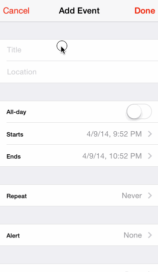
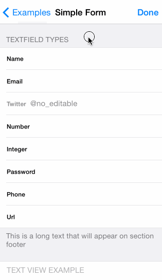
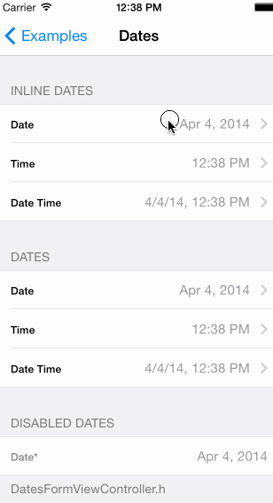
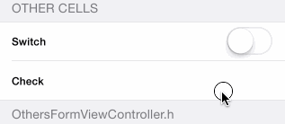
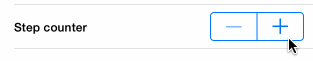
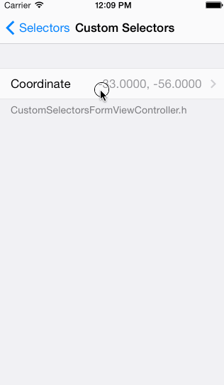

XLForm 
---------------

By [XMARTLABS](http://xmartlabs.com).

[](https://travis-ci.org/xmartlabs/XLForm)

Purpose
--------------

XLForm is the most flexible and powerful iOS library to create dynamic table-view forms. The goal of the library is to get the same power of hand-made forms but spending 1/10 of the time.

XLForm provides a very powerful DSL used to create a form. It keeps track of this specification on runtime, updating the UI on the fly.

#####Let's see the iOS 7 Calendar Event Form created using XLForm





What XLForm does
----------------

 * Loads a form based on a declarative [*form definition*](https://github.com/xmartlabs/XLForm#how-to-create-a-form "form definition").
 * Keeps track of definition changes on runtime to update the form interface accordingly. Further information on [*Dynamic Forms*](https://github.com/xmartlabs/XLForm#dynamic-forms---how-to-change-the-form-dynamically-at-runtime "Dynamic Forms") section of this readme.
 * Supports multivalued sections. For further details see [*Multivalued Sections*](https://github.com/xmartlabs/XLForm#multivalued-sections "Multivalued Sections") section bellow.
 * Supports [*custom rows definition*](https://github.com/xmartlabs/XLForm#how-to-create-a-custom-row).
 * Supports custom selectors. For further details of how to define your own selectors check [*Custom selectors*](https://github.com/xmartlabs/XLForm#custom-selectors---selector-row-with-a-custom-selector-view-controller "Custom Selectors") section out.
 * Provides several inline selectors such as date picker and picker inline selectos and brings a way to create custom inline selectors.
 * Validates the form data based on form definition and shows error messages.
 * Changes the firstResponder among `UITextField`s and `UITextView`s when keyboard return button is pressed.


How to create a form
-----------------------------

To create a form we should declare it through a `XLFormDescriptor` instance and assign it to a `XLFormViewController` instance. As we said XLForm works based on a DSL that hides complex and boilerplate stuff without losing the power and flexibility of hand-made forms.

To define a form we use 3 classes: 

 * `XLFormDescriptor`
 * `XLFormSectionDescriptor`
 * `XLFormRowDescriptor`

A form definition is a `XLFormDescriptor` instance that contains one or more sections (`XLFormSectionDescriptor` instances) and each section contains several rows (`XLFormRowDescriptor` instance). As you may have noticed the DSL structure is analog to the structure of a `UITableView` (Table -->> Sections -- >> Rows). The resulting table-view form's structure (sections and rows order) mirrors the definition's structure.

#####Let's see part of the iOS 7 Calendar Event Form definition.


```objc
XLFormDescriptor * form;
XLFormSectionDescriptor * section;
XLFormRowDescriptor * row;

form = [XLFormDescriptor formDescriptorWithTitle:@"Add Event"];

// First section        
section = [XLFormSectionDescriptor formSection];
[form addFormSection:section];
        
// Title
row = [XLFormRowDescriptor formRowDescriptorWithTag:@"title" rowType:XLFormRowDescriptorTypeText];
[row.cellConfigAtConfigure setObject:@"Title" forKey:@"textField.placeholder"];
[section addFormRow:row];
        
// Location
row = [XLFormRowDescriptor formRowDescriptorWithTag:@"location" rowType:XLFormRowDescriptorTypeText];
[row.cellConfigAtConfigure setObject:@"Location" forKey:@"textField.placeholder"];
[section addFormRow:row];

// Second Section
section = [XLFormSectionDescriptor formSection];
[form addFormSection:section];
        
// All-day
row = [XLFormRowDescriptor formRowDescriptorWithTag:@"all-day" rowType:XLFormRowDescriptorTypeBooleanSwitch title:@"All-day"];
[section addFormRow:row];
        
// Starts
row = [XLFormRowDescriptor formRowDescriptorWithTag:@"starts" rowType:XLFormRowDescriptorTypeDateTimeInline title:@"Starts"];
row.value = [NSDate dateWithTimeIntervalSinceNow:60*60*24];
[section addFormRow:row];
```

XLForm will load the table-view form from the previously explained definition. The most interesting part is that it will update the table-view form based on the form definition modifications.
That means that we are able to make changes on the table-view form adding or removing section definitions or row  definitions to the form definition on runtime and you will never need to care again about `NSIndexPath`, `UITableViewDelegate`, `UITableViewDataSource` or other complexities.


**To see more complex form definitions take a look at the example application in the Examples folder of this repository. You can also run the examples on your own device if you wish.** XLForm **has no** dependencies over other pods, anyway the examples  project makes use of some cocoapods to show advanced XLForm features.

How to run XLForm examples
---------------------------------

1. Clone the repository `git@github.com:xmartlabs/XLForm.git`. Optionally you can fork the repository and clone it from your own github account, this approach would be better in case you want to contribute.
2. Install cocoapod dependencies of example project. From the root folder of the cloned XLForm repository run `pod install`.
3. Open XLForm workspace using XCode and run the project. Enjoy!


Rows
---------------------
####Input Rows




Input rows allows the user to enter text values. Basically they use `UITextField` or `UITextView` controls. The main differences among the input row types is the `keyboardType`, `autocorrectionType` and `autocapitalizationType` configuration.

```objc
static NSString *const XLFormRowDescriptorTypeText = @"text";
```
Will be represented by a `UITextField` with `UITextAutocorrectionTypeDefault`, `UITextAutocapitalizationTypeSentences` and `UIKeyboardTypeDefault`.   

```objc
static NSString *const XLFormRowDescriptorTypeName = @"name";
```
Will be represented by a `UITextField` with `UITextAutocorrectionTypeNo`, `UITextAutocapitalizationTypeWords` and `UIKeyboardTypeDefault`.

```objc
static NSString *const XLFormRowDescriptorTypeURL = @"url";
```
Will be represented by a `UITextField` with `UITextAutocorrectionTypeNo`, `UITextAutocapitalizationTypeNone` and `UIKeyboardTypeURL`.

```objc
static NSString *const XLFormRowDescriptorTypeEmail = @"email";
```
Will be represented by a `UITextField` with `UITextAutocorrectionTypeNo`, `UITextAutocapitalizationTypeNone` and `UIKeyboardTypeEmailAddress`.

```objc
static NSString *const XLFormRowDescriptorTypePassword = @"password";
```
Will be represented by a `UITextField` with `UITextAutocorrectionTypeNo`, `UITextAutocapitalizationTypeNone` and `UIKeyboardTypeASCIICapable`.
This row type also set the  `secureTextEntry` to `YES` in order to hide what the user types. 

```objc
static NSString *const XLFormRowDescriptorTypeNumber = @"number";
```
Will be represented by a `UITextField` with `UITextAutocorrectionTypeNo`, `UITextAutocapitalizationTypeNone` and `UIKeyboardTypeNumbersAndPunctuation`.

```objc
static NSString *const XLFormRowDescriptorTypePhone = @"phone";
```
Will be represented by a `UITextField` with `UIKeyboardTypePhonePad`.

```objc
static NSString *const XLFormRowDescriptorTypeTwitter = @"twitter";
```
Will be represented by a `UITextField` with `UITextAutocorrectionTypeNo`, `UITextAutocapitalizationTypeNone` and `UIKeyboardTypeTwitter`.

```objc
static NSString *const XLFormRowDescriptorTypeAccount = @"account";
```
Will be represented by a `UITextField` with `UITextAutocorrectionTypeNo`, `UITextAutocapitalizationTypeNone` and `UIKeyboardTypeDefault`.

```objc
static NSString *const XLFormRowDescriptorTypeInteger = @"integer";
```
Will be represented by a `UITextField` with `UIKeyboardTypeNumberPad`.

```objc
static NSString *const XLFormRowDescriptorTypeDecimal = @"decimal";
```
Will be represented by a `UITextField` with `UIKeyboardTypeDecimalPad`.

```objc
static NSString *const XLFormRowDescriptorTypeTextView = @"textView";
```
Will be represented by a `UITextView` with `UITextAutocorrectionTypeDefault`, `UITextAutocapitalizationTypeSentences` and `UIKeyboardTypeDefault`.


####Selector Rows

Selector rows allow us to select a value or values from a list. XLForm supports 8 types of selectors out of the box:


```objc
static NSString *const XLFormRowDescriptorTypeSelectorPush = @"selectorPush";
```

```objc
static NSString *const XLFormRowDescriptorTypeSelectorActionSheet = @"selectorActionSheet";
```

```objc
static NSString *const XLFormRowDescriptorTypeSelectorAlertView = @"selectorAlertView";
```

```objc
static NSString *const XLFormRowDescriptorTypeSelectorLeftRight = @"selectorLeftRight";
```

```objc
static NSString *const XLFormRowDescriptorTypeSelectorPickerView = @"selectorPickerView";
```

```objc
static NSString *const XLFormRowDescriptorTypeSelectorPickerViewInline = @"selectorPickerViewInline";
```

```objc
static NSString *const XLFormRowDescriptorTypeSelectorSegmentedControl = @"selectorSegmentedControl";
```

```objc
static NSString *const XLFormRowDescriptorTypeMultipleSelector = @"multipleSelector";
```


Normally we will have a collection of object to select (these objects should have a string to display them and a value in order to serialize them), XLForm has to be able to display these objects as well as  to be able to create the object HTTP parameter properly.

XLForm follows the following rules to display an object:

1. If the object is a `NSString` or `NSNumber` it uses the object `description` property. 
2. If the object conforms to protocol `XLFormOptionObject`, XLForm gets the display value from `formDisplayText` method.
3. Otherwise it return nil. That means you should conforms the protocol `:)`.


XLForm follows the following rules to get the option value:

1. If the object is a `NSString`, `NSNumber` or `NSDate` it uses the object itself as the option value. 
2. If the object conforms to protocol `XLFormOptionObject`, XLForm gets the option value from `formValue` method.
3. Otherwise it return nil. That means you should conforms the protocol :).

 
This is the protocol declaration: 

```objc
@protocol XLFormOptionObject <NSObject>

@required
-(NSString *)formDisplayText;
-(id)formValue;

@end
```


####Date Rows

XLForms supports 3 types of dates: `Date`, `DateTime` and `Time` and it's able to present the `UIDatePicker` control in 2 different ways, inline and non-inline.




```objc
static NSString *const XLFormRowDescriptorTypeDateInline = @"dateInline";
```

```objc
static NSString *const XLFormRowDescriptorTypeDateTimeInline = @"datetimeInline";
```

```objc
static NSString *const XLFormRowDescriptorTypeTimeInline = @"timeInline";
```

```objc
static NSString *const XLFormRowDescriptorTypeDate = @"date";
```

```objc
static NSString *const XLFormRowDescriptorTypeDateTime = @"datetime";
```

```objc
static NSString *const XLFormRowDescriptorTypeTime = @"time";
```

Here is an example of how to define these row types:


```objc
XLFormDescriptor * form;
XLFormSectionDescriptor * section;
XLFormRowDescriptor * row;

form = [XLFormDescriptor formDescriptorWithTitle:@"Dates"];

section = [XLFormSectionDescriptor formSectionWithTitle:@"Inline Dates"];
[form addFormSection:section];

// Date
row = [XLFormRowDescriptor formRowDescriptorWithTag:kDateInline rowType:XLFormRowDescriptorTypeDateInline title:@"Date"];
row.value = [NSDate new];
[section addFormRow:row];

// DateTime
row = [XLFormRowDescriptor formRowDescriptorWithTag:kTimeInline rowType:XLFormRowDescriptorTypeTimeInline title:@"Time"];
row.value = [NSDate new];
[section addFormRow:row];

// Time
row = [XLFormRowDescriptor formRowDescriptorWithTag:kDateTimeInline rowType:XLFormRowDescriptorTypeDateTimeInline title:@"Date Time"];
row.value = [NSDate new];
[section addFormRow:row];
```


####Boolean Rows

XLForms supports 2 types of boolean controls:




```objc
static NSString *const XLFormRowDescriptorTypeBooleanCheck = @"booleanCheck";
```

```objc
static NSString *const XLFormRowDescriptorTypeBooleanSwitch = @"booleanSwitch";
```

We can also simulate other types of Boolean rows using any of the Selector Row Types introduced in the Selector Rows section.


####Other Rows

#####Stepper

XLForms supports counting using UIStepper control:




```objc
static NSString *const XLFormRowDescriptorTypeStepCounter = @"stepCounter";
```
#####Slider

XLForms supports counting using UISlider control:


```objc
static NSString *const XLFormRowDescriptorTypeSlider = @"slider";
```

You can adjust the slider for your own interests very easily:

```objc
	row = [XLFormRowDescriptor formRowDescriptorWithTag:kSlider rowType:XLFormRowDescriptorTypeSlider title:@"Slider"];
	row.value = @(30);
	[row.cellConfigAtConfigure setObject:@(100) forKey:@"slider.maximumValue"];
	[row.cellConfigAtConfigure setObject:@(10) forKey:@"slider.minimumValue"];
	[row.cellConfigAtConfigure setObject:@(4) forKey:@"steps"];
```

Set `steps` to `@(0)` to disable the steps functionality.

Multivalued Sections
------------------------

Any `XLFormSectionDescriptor` could be set up to support multivalued rows. Multivalued Sections let the user enter multiple values (of the same type) for a field by adding or removing rows. 
The most interesting part of multivalued `XLFormSectionDescriptor` is that it supports all the types of rows that were shown on the [*Rows*](https://github.com/xmartlabs/XLForm#rows "Rows") section.   


### How to set up a multivalued section

To create a multivalued section we should set `YES` to the `isMultivaluedSection` property of `XLFormSectionDescriptor`. We can also do that creating the `XLFormSectionDescriptor` instance using the this alternative constructor:

```objc
+(id)formSectionWithTitle:(NSString *)title multivaluedSection:(BOOL)multivaluedSection;
```

We have also to set up the `multiValuedTag` property. `multiValuedTag` will be used to create the HTTP parameter key for the collection of values (rows added to the section).

```objc
XLFormDescriptor * form;
XLFormSectionDescriptor * section;
XLFormRowDescriptor * row;
    
NSArray * nameList = @[@"family", @"male", @"female", @"client"];
        
form = [XLFormDescriptor formDescriptorWithTitle:@"Multivalued examples"];
    
// MultivaluedSection section
section = [XLFormSectionDescriptor formSectionWithTitle:@"MultiValued TextField" multivaluedSection:YES];
section.multiValuedTag = @"textFieldRow";
[form addFormSection:section];
    
for (NSString * tag in nameList) {
	// add a row to the section, each row will represent a name of the name list array.
	row = [XLFormRowDescriptor formRowDescriptorWithTag:nil rowType:XLFormRowDescriptorTypeText title:nil];
	[[row cellConfig] setObject:@"Add a new tag" forKey:@"textField.placeholder"];row.value = [tag copy];
	[section addFormRow:row];
}
// add an empty row to the section.
row = [XLFormRowDescriptor formRowDescriptorWithTag:nil rowType:XLFormRowDescriptorTypeText title:nil];
[[row cellConfig] setObject:@"Add a new tag" forKey:@"textField.placeholder"];
[section addFormRow:row];
```


Form Values
------------------------

#### formValues

You can get all form values invoking `-(NSDictionary *)formValues;` to either `XLFormViewController` instance or `XLFormDescriptor` instance.

The returned `NSDictionary` is created following this rules: 

`XLForm` adds a value for each `XLFormRowDescriptor` instance not contained in a multivalued section, the dictionary key is the value of `XLFormRowDescriptor` `tag` property.

It also adds a dictionary item for each multivalued section containing an `NSArray` with the instance values of the `XLFormRowDescriptor`s contained in the section. 
For instance, if we have a section with the tag property equal to `tags` and the following values on the contained rows: 'family', 'male', 'female', 'client', the generated value will be `tags: ['family', 'male', 'female', 'client']`


#### httpParameters

In same cases the form value we need may differ from the value of `XLFormRowDescriptor` instance. This is usually the case of selectors row and when we need to send the form values to some endpoint, the selected value could be a core data object or any other object. In this cases XLForm need to know how to get the value and the description of the selected object.

When using `-(NSDictionary *)httpParameters` method, `XLForm` follows the following rules to get `XLFormRowDescriptor` value:

1. If the object is a `NSString`, `NSNumber` or `NSDate`, the value is the object itself 
2. If the object conforms to protocol `XLFormOptionObject`, XLForm gets the value from `formValue` method.
3. Otherwise it return nil.


This is the protocol declaration: 

```objc
@protocol XLFormOptionObject <NSObject>

@required
-(NSString *)formDisplayText;
-(id)formValue;

@end
```


How to create a Custom Row
-------------------------------

To create a custom cell you should conform to @protocol `XLFormDescriptorCell` within your custom `UITableViewCell`. You can also sublass the convenience class `XLFormBaseCell` which conforms to `XLFormDescriptorCell`. In your implementation add the following required methods:

```objc
// initialise all objects such as Arrays, UIControls etc...
- (void)configure;

// update cell when it about to be presented
- (void)update;
```

Add optional methods to create custom behaviour

```objc
// height of the cell
+(CGFloat)formDescriptorCellHeightForRowDescriptor:(XLFormRowDescriptor *)rowDescriptor;

// called when cell wants to become active
-(BOOL)formDescriptorCellBecomeFirstResponder;

// called when cell requested to loss first responder 
-(BOOL)formDescriptorCellResignFirstResponder;

// called when cell been selected
-(void)formDescriptorCellDidSelectedWithFormController:(XLFormViewController *)controller;

// called to validate cell, return error or nil if there no error
-(NSError *)formDescriptorCellLocalValidation;

// http parameter name used for network request
-(NSString *)formDescriptorHttpParameterName;

```

Once custom cell has been created you have to let `XLFormRowDescriptor` know about this class either setting the cellClass property i.e `customRowDescriptor.cellClass = [XLFormCustomCell class]` or before `XLFormViewController` initialized add your custom cell to cellClassesForRowDescriptorTypes dictionary i.e `[[XLFormViewController cellClassesForRowDescriptorTypes] setObject:[MYCustomCellClass class] forKey:kMyAppCustomCellType];`


Custom Selectors - Selector Row with a custom selector view controller
--------------------------------------------

Almost always the basic selector which allows the user to select one or multiple items from a pushed view controller is enough for owr needs, but sometimes we need more flexibility to bring a better user experience to the user or do something not supported by default.

Let's say your app user neets to select a map coordinate or it needs to select a value fetched from a server endpoint. How do we do that easily?





Define the previous selector row is as simple as ...

```objc
row = [XLFormRowDescriptor formRowDescriptorWithTag:kSelectorMap rowType:XLFormRowDescriptorTypeSelectorPush title:@"Coordinate"];
// set up the selector controller class 
row.selectorControllerClass = [MapViewController class];
// Set up a NSValueTransformer to convert CLLocation to NSString, it's used to show the select value description (text).  
row.valueTransformer = [CLLocationValueTrasformer class];
// Set up the default value
row.value = [[CLLocation alloc] initWithLatitude:-33 longitude:-56];
```


`selectorControllerClass` controller class should conform to `XLFormRowDescriptorViewController` protocol. 

In the example above, `MapViewController` conforms to `XLFormRowDescriptorViewController`.

```objc
@protocol XLFormRowDescriptorViewController <NSObject>

@required
@property (nonatomic) XLFormRowDescriptor * rowDescriptor;

@end
```

XLForm sets up `rowDescriptor` property using the `XLFormRowDescriptor` instance that belongs to the selector row. 

The developer is responsible for update its views with the `rowDescriptor` value as well as set the selected value to `rowDescriptor` from within the custom selector view controller.


#### Another example


```objc
row = [XLFormRowDescriptor formRowDescriptorWithTag:kSelectorUser rowType:XLFormRowDescriptorTypeSelectorPush title:@"User"];
row.selectorControllerClass = [UsersTableViewController class];
```

You can find the details of these examples within the example repository folder, `Examples/Selectors/CustomSelectors/` and  `Examples/Selectors/DynamicSelector`.


Dynamic Forms - How to change the form dynamically at runtime
-------------------------------

Any change made on the `XLFormDescriptor` will be reflected on the `XLFormViewController` tableView. That means that we can add or remove sections or rows at any time and XLForm will animate the section or row accordingly. 

We shouldn't have again to work with `NSIndexPaths` or add, remove `UITableViewCell`. `NSIndexPath` of a specific `TableViewCell` changes along the time and this makes very hard to keep track of the `NSIndexPath` of each `UITableViewCell`. 

On XLForm, each `XLFormRowDescriptor` has a `tag` property that is set up in its constructor. `XLFormDescriptor` has, among other helpers, an specific one to get a `XLFormRowDescriptor` from a `tag`.
It's much easier to manage `XLFormRowDescriptor`s using tags, the tag should be unique and it doesn't change on tableview additions modifications or deletions.

It's important keep in mind that all the `UITableView` form modifications have to be made using the descriptors and not making modifications directly on the `UITableView`.

Usually you may want to change the form when some value change or some row or section is added or removed. In order to keep posted about the form descriptor modifications your `XLFormViewController` subclass should override the `XLFormDescriptorDelegate` methods of 'XLFormViewController'.

```objc
@protocol XLFormDescriptorDelegate <NSObject>

@required

-(void)formSectionHasBeenRemoved:(XLFormSectionDescriptor *)formSection atIndex:(NSUInteger)index;
-(void)formSectionHasBeenAdded:(XLFormSectionDescriptor *)formSection atIndex:(NSUInteger)index;
-(void)formRowHasBeenAdded:(XLFormRowDescriptor *)formRow atIndexPath:(NSIndexPath *)indexPath;
-(void)formRowHasBeenRemoved:(XLFormRowDescriptor *)formRow atIndexPath:(NSIndexPath *)indexPath;
-(void)formRowDescriptorValueHasChanged:(XLFormRowDescriptor *)formRow oldValue:(id)oldValue newValue:(id)newValue;

@end
```

For instance if we want to show or hide a row depending on the value of another row:

```objc
-(void)formRowDescriptorValueHasChanged:(XLFormRowDescriptor *)rowDescriptor oldValue:(id)oldValue newValue:(id)newValue
{
	[super formRowDescriptorValueHasChanged:rowDescriptor oldValue:oldValue newValue:newValue]; 
    if ([rowDescriptor.tag isEqualToString:@"alert"]){
        if ([[rowDescriptor.value valueData] isEqualToNumber:@(0)] == NO && [[oldValue valueData] isEqualToNumber:@(0)]){
            XLFormRowDescriptor * newRow = [rowDescriptor copy];
            [newRow setTag:@"secondAlert"];
            newRow.title = @"Second Alert";
            [self.form addFormRow:newRow afterRow:rowDescriptor];
        }
        else if ([[oldValue valueData] isEqualToNumber:@(0)] == NO && [[newValue valueData] isEqualToNumber:@(0)]){
            [self.form removeFormRowWithTag:@"secondAlert"];
        }
    }
```

Open form in Popover
------------------------------------

Configure your row with `XLFormRowDescriptorTypeSelectorPopover`

```objc
row = [XLFormRowDescriptor formRowDescriptorWithTag:rowTag rowType:XLFormRowDescriptorTypeSelectorPopover title:@"PickerForm"];
```

Implement protocols `XLFormRowDescriptorViewController, XLFormRowDescriptorPopoverViewController` in your custom form class:

```objc
#import "XLFormRowDescriptor.h"
#import "XLForm.h"

@interface PickerForm : UITableViewController <XLFormRowDescriptorViewController,XLFormRowDescriptorPopoverViewController, UITableViewDelegate, UITableViewDataSource>

@end
```

Implement button to allow user to dismiss popover, synthesize popoverController:

```objc
@implementation PickerForm

@synthesize rowDescriptor;
@synthesize popoverController;


-(void)viewDidLoad{
	[super viewDidLoad];
	self.navigationController.navigationBarHidden=NO;
	self.navigationItem.leftBarButtonItem=[[UIBarButtonItem alloc] initWithBarButtonSystemItem:UIBarButtonSystemItemCancel target:self action:@selector(dismiss)];
}

-(void)dismiss{
	[self.popoverController dismissPopoverAnimated:YES];
}
```

```objc
Also dismiss popover on row select:
- (void)tableView:(UITableView *)tableView didSelectRowAtIndexPath:(NSIndexPath *)indexPath
{
	self.rowDescriptor.value=[XLFormOptionsObject formOptionsObjectWithValue:@(indexPath.row) displayText:@""];
	[self.popoverController dismissPopoverAnimated:YES];
}
```

Validations
------------------------------------

XLForm supports 2 types of app validation so far. 

* Is Required Validation.
* Email validation.

Improving XLForms validation support is in the roadmap.

XLForm shows one error at a time showing it as `UIAlertView`.

You may want to change the list of validation errors. You can do that overriding the following method of `XLFormViewController`, please make sure you call superclass implementation.

```objc
-(NSArray *)formValidationErrors;
```

You can also change the way the error messages are shown overriding:

```objc
-(void)showFormValidationError:(NSError *)error;
```
   

Additional configuration of Rows
--------------------------------

`XLFormRowDescriptor` allow us to configure generic aspects of a `UITableViewCell`, for example: the `rowType`, the `label`, the `value` (default value), if the cell is `required` or `disabled`, and so on.

You may want to set up another properties of the `UITableViewCell`. To set up another properties `XLForm` makes use of [Key-Value Coding](https://developer.apple.com/LIBRARY/IOS/documentation/Cocoa/Conceptual/KeyValueCoding/Articles/KeyValueCoding.html "Key-Value Coding") allowing the developer to set the cell properties by keyPath. 

You just have to add the properties to `cellConfig` or `cellConfigAtConfigure` dictionary property of `XLFormRowDescriptor`.
The main difference between `cellConfig` and `cellConfigAtConfigure` is the time when the property is set up. `cellConfig` properties are set up each time before display a cell. `cellConfigAtConfigure`, on the other hand, set up the property just after the init method of the cell is called and only one time.


For instance if you want to set up the placeholder you can do the following:

```objc
row = [XLFormRowDescriptor formRowDescriptorWithTag:@"title" rowType:XLFormRowDescriptorTypeText];
[row.cellConfigAtConfigure setObject:@"Title" forKey:@"textField.placeholder"];
[section addFormRow:row];
```

Let's see how to change the color of the cell label: 

```objc
row = [XLFormRowDescriptor formRowDescriptorWithTag:@"title" rowType:XLFormRowDescriptorTypeText];
[row.cellConfigAtConfigure setObject:[UIColor red] forKey:@"textLabel.textColor"];
[section addFormRow:row];
```

FAQ
-------

#### How to assign the first responder on form appearance

Assign the first responder when the form is shown is as simple as setting the property `assignFirstResponderOnShow` to `YES`. By default the value of the property is `NO`.

```objc
@property (nonatomic) BOOL assignFirstResponderOnShow;
```

#### How to set a value to a row.

You should set the `value` property of `XLFormRowDescriptor` relevant instance.

```objc
@property (nonatomic) id value;
```

You may notice that the `value` property type is `id` and you are the responsable to set a value with the proper type. For instance, you should set a `NSString` value to a `XLFormRowDescriptor` instance of `XLFormRowDescriptorTypeText`.

You may have to update the cell to see the UI changes if the row is already presented. 
`-(void)reloadFormRow:(XLFormRowDescriptor *)formRow` method is provided by `XLFormViewController` to do so.   

#### How to set the default value to a row.

You should do the same as [*How to set a value to a row*](https://github.com/xmartlabs/XLForm#how-to-set-a-value-to-a-row "How to set a value to a row").


#### How to set up the options to a selector row.

XLForm has several types of selectors rows. Almost all of them need to know which are the values to be selected. For a particular `XLFormRowDescriptor` instance you spefify these values setting a `NSArray` instance to `selectorOptions` property.

```objc
@property NSArray * selectorOptions;
```

#### How to get form values

If you want to get the raw form values you should call `formValues` method of `XLFormDescriptor`. Doing that you will get a dictionary containing all the form values. 
`tag` property value of each row is used as dictionary key. Only `XLFormROwDescriptor` values for non nil `tag` values are added to the dictionary.

You may be interested in the form values to use it as enpoint parameter. In this case `httpParameters` would be useful.

If you need something different, you can iterate over each row...

```objc
 NSMutableDictionary * result = [NSMutableDictionary dictionary];
 for (XLFormSectionDescriptor * section in self.form.formSections) {
     if (!section.isMultivaluedSection){
         for (XLFormRowDescriptor * row in section.formRows) {
             if (row.tag && ![row.tag isEqualToString:@""]){
                 [result setObject:(row.value ?: [NSNull null]) forKey:row.tag];
             }
         }
     }
     else{
         NSMutableArray * multiValuedValuesArray = [NSMutableArray new];
         for (XLFormRowDescriptor * row in section.formRows) {
             if (row.value){
                 [multiValuedValuesArray addObject:row.value];
             }
         }
         [result setObject:multiValuedValuesArray forKey:section.multiValuedTag];
     }
 }
 return result;
```

#### How to change a UITableViewCell font

You can change the font or any other table view cell property using the `cellConfig` dictionary property. XLForm will set up `cellConfig` dictionary values when the table view cell is about to be displayed.

```objc
[row.cellConfig setObject:[UIColor greenColor] forKey:@"textLabel.textColor"];
[row.cellConfig setObject:[UIFont fontWithName:FONT_LATO_REGULAR size:12.0] forKey:@"textLabel.font"];
[row.cellConfig setObject:[UIFont fontWithName:FONT_LATO_REGULAR size:12.0] forKey:@"detailTextLabel.font"];
```

For further details, please take a look at [UICustomizationFormViewController.m](/Examples/UICustomization/UICustomizationFormViewController.m) example.
 

Installation
--------------------------

The easiest way to use XLForm in your app is via [CocoaPods](http://cocoapods.org/ "CocoaPods").

1. Add the following line in the project's Podfile file:
`pod 'XLForm', '~> 2.1.0'`.
2. Run the command `pod install` from the Podfile folder directory.

XLForm **has no** dependencies over other pods.


### How to use master branch

Often master branch contains most recent features and latest fixes. On the other hand this features was not fully tested and changes on master may occur at any time. For the previous reasons I stongly recommend to fork the repository and manage the updates from master on your own making the proper pull on demand.


To use xmartlabs master branch.....

`pod 'XLForm', :git => 'https://github.com/xmartlabs/XLForm.git'`

You can replace the repository URL for your forked version url if you wish.


Requirements
-----------------------------

* ARC
* iOS 7.0 and above


Release Notes
--------------

Version 2.0.1 (master)

* Change `XLFormRowDescriptorTypeText`, `XLFormRowDescriptorTypeName` and `XLFormRowDescriptorTypeTextView` keyboard type to `UIKeyboardTypeDefault`.
* Added `XLFormRowDescriptorTypeInfo` row type and example.
* Added `XLFormRowDescriptorTypeSelectorPopover` row type and example.
* CI added. Created Test project into Tests folder and set up Travis.
* Documented how to customize UI. Added an example.
* Now XLFormViewController extends from UIViewController instead of UITableViewController.
* Added tableView property as a XLFormViewController IBOutlet.
* Added support for storyboard reuse identifier and nib file.
* Button selection can be handled using a selector or block.
* Added addAsteriskToRequiredRowsTitle property to XLFormDescriptor. NO is used as value by default.
* Image cell has been removed because it depends on AFNetworking and now needs to be implemented as a custom cell. You can find the image custom cell in Examples/Others/CustomCells.

Version 2.0.0 (cocoaPod)

* Added `XLFormRowDescriptorTypeMultipleSelector` row type and example.
* Added `XLFormRowDescriptorTypeSelectorPickerView` row type and example.
* Added `XLFormRowDescriptorTypeSelectorPickerViewInline` row type and example.
* Added generic way to create inline selector rows.
* Ability to customize row animations.
* `(NSDictionary *)formValues;` XLFormViewController method added in order to get raw form data.
* Added `XLFormRowDescriptorTypeSelectorSegmentedControl` row type and example.
* AFNetworking dependency removed.
* Added `XLFormRowDescriptorTypeStepCounter` row type and related example.


Version 1.0.1 (cocoaPod)

* Added storyboard example.
* Added button `XLFormRowDescriptorTypeButton` example.
* Documented how to add a custom row.
* Fixed issues: [#2](https://github.com/xmartlabs/XLForm/issues/2 "#2"), [#3](https://github.com/xmartlabs/XLForm/issues/3 "#3"), [#27](https://github.com/xmartlabs/XLForm/issues/27 "#27"), [#38](https://github.com/xmartlabs/XLForm/issues/38 "#38").
* Fixed crash caused by inline date rows. [#6](https://github.com/xmartlabs/XLForm/issues/6 "#6")
* Fixed ipad issue *invalid cell layout*. [#10](https://github.com/xmartlabs/XLForm/issues/10 "#10")
* New convenience methods to insert sections dinamically. [#13](https://github.com/xmartlabs/XLForm/pull/13 "#13")
* Change default label style to `UIFontTextStyleBody`. [#18](https://github.com/xmartlabs/XLForm/issues/18 "#18")
* Added step counter row, `XLFormRowDescriptorTypeStepCounter`.
* Added `initWithCoder` initializer to `XLFormViewController`. [#32](https://github.com/xmartlabs/XLForm/issues/32 "#32").
* Added a convenience method to deselect a `XLFormRowDescriptor`. `-(void)deselectFormRow:(XLFormRowDescriptor *)row;`. [#33](https://github.com/xmartlabs/XLForm/issues/33 "#33").


Version 1.0.0 (cocoaPod)

* Initial release

Contact
----------------

If you are using XLForm in your app and have any suggestion or question:

Martin Barreto, <martin@xmartlabs.com>, [@mtnBarreto](http://twitter.com/mtnBarreto "@mtnBarreto")

[@xmartlabs](http://twitter.com/xmartlabs "@xmartlabs")
