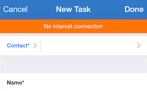
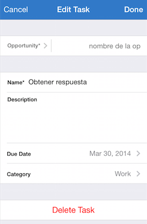

#XMARTLABS - XLForm 
---------------

Purpose
--------------

XLForm is the most flexible and powerful iOS library to create dynamic table-view forms. The goal of the library is to get the same power of hand-made forms but spending 1/10 of the time.

XLForm provides a very powerful DSL used to create a form, validate & serialize the form data. It keeps track of this specification on runtime, updating the UI on the fly.

#####Let's see the iOS 7 Calendar Event Form created using XLForm


What XLForm does
----------------

 * Loads a form based on a declarative form definition.
 * Keeps track of definition changes on runtime to update the form interface accordingly. Further information on *Dynamic Forms* section of this readme.
 * Supports multivalued sections. For further details see *Multivalued Sections* section bellow.  
 * Shows the *Cancel* and *Done* buttons. The form view controller (XLFormViewCotnroller instance or any subclass of it) must be contained on a UINavigationController.
 * Validates the form data based on form definition and shows error messages.
 * Serializes form data using `AFNetworking 2.0`. 
 * Shows *no internet connection* message using [AFNetworking](https://github.com/AFNetworking/AFNetworking "AFNetworking") network reachability support.
 * Shows asynchronous indicator when a server request is happening using [MRProgress](https://github.com/mrackwitz/MRProgress "MRProgress").
 * Has support for Create and Edit modes.
 * Supports core data objects and dynamic selectors using [XLDataLoader](https://github.com/xmartlabs/XLDataLoader "XLDataLoader").
 * Changes the firstResponder among `UITextField`s and `UITextView`s when keyboard return button is pressed.


How to create a form
-----------------------------

To create a form we should declare it through a `XLFormDescriptor` instance and assign it to a `XLFormViewController` instance. As we said XLForm works based on a DSL that hides complex and boilerplate stuff without losing the power and flexibility of hand-made forms.

To define a form we use 3 classes: 

 * `XLFormDescriptor`
 * `XLFormSectionDescriptor`
 * `XLFormRowDescriptor`

A form definition is a `XLFormDescriptor` instance that contains one or more sections (`XLFormSectionDescriptor` instances) and each section contains several rows (`XLFormRowDescriptor` instance). As you may have noticed the DSL structure is analog to the structure of a `UITableView` (Table -->> Sections -- >> Rows). The resulting table-view form's structure (sections and rows order) mirrors the definition's structure.

#####Let's see part of the iOS 7 Calendar Event Form definition.


```objc
XLFormDescriptor * form;
XLFormSectionDescriptor * section;
XLFormRowDescriptor * row;

form = [XLFormDescriptor formDescriptorWithTitle:@"Add Event"];

// First section        
section = [XLFormSectionDescriptor formSectionWithTitle:nil];
[form addFormSection:section];
        
// Title
row = [XLFormRowDescriptor formRowDescriptorWithTag:@"title" rowType:XLFormRowDescriptorTypeText];
[row.cellConfigAtConfigure setObject:@"Title" forKey:@"textField.placeholder"];
[section addFormRow:row];
        
// Location
row = [XLFormRowDescriptor formRowDescriptorWithTag:@"location" rowType:XLFormRowDescriptorTypeText];
[row.cellConfigAtConfigure setObject:@"Location" forKey:@"textField.placeholder"];
[section addFormRow:row];

// Second Section
section = [XLFormSectionDescriptor formSectionWithTitle:nil];
[form addFormSection:section];
        
// All-day
row = [XLFormRowDescriptor formRowDescriptorWithTag:@"all-day" rowType:XLFormRowDescriptorTypeBooleanSwitch title:@"All-day"];
[section addFormRow:row];
        
// Starts
row = [XLFormRowDescriptor formRowDescriptorWithTag:@"starts" rowType:XLFormRowDescriptorTypeDateTimeInline title:@"Starts"];
row.value = [NSDate dateWithTimeIntervalSinceNow:60*60*24];
[section addFormRow:row];

```

XLForm will load the table-view form from the previously explained definition. The most interesting part is that it will update the table-view form based on the form definition modifications.
That means that we are able to make changes on the table-view form adding or removing section definitions or row  definitions to the form definition on runtime and you will never need to care again about `NSIndexPath`, `UITableViewDelegate`, `UITableViewDataSource` or other complexities.


**To see more complex form definitions take a look at the example application in the Examples folder of this repository. You can also run the examples on your own device if you wish.**


Rows
---------------------
####Input Rows


Input rows allows the user to enter text values. Basically they use `UITextField` or `UITextView` controls. The main differences among the input row types is the `keyboardType`, `autocorrectionType` and `autocapitalizationType` configuration.

```objc
static NSString *const XLFormRowDescriptorTypeText = @"text";
```
Will be represented by a `UITextField` with `UITextAutocorrectionTypeDefault`, `UITextAutocapitalizationTypeSentences` and `UIKeyboardTypeAlphabet`.   

```objc
static NSString *const XLFormRowDescriptorTypeName = @"name";
```
Will be represented by a `UITextField` with `UITextAutocorrectionTypeNo`, `UITextAutocapitalizationTypeWords` and `UIKeyboardTypeAlphabet`.

```objc
static NSString *const XLFormRowDescriptorTypeURL = @"url";
```
Will be represented by a `UITextField` with `UITextAutocorrectionTypeNo`, `UITextAutocapitalizationTypeNone` and `UIKeyboardTypeURL`.

```objc
static NSString *const XLFormRowDescriptorTypeEmail = @"email";
```
Will be represented by a `UITextField` with `UITextAutocorrectionTypeNo`, `UITextAutocapitalizationTypeNone` and `UIKeyboardTypeEmailAddress`.

```objc
static NSString *const XLFormRowDescriptorTypePassword = @"password";
```
Will be represented by a `UITextField` with `UITextAutocorrectionTypeNo`, `UITextAutocapitalizationTypeNone` and `UIKeyboardTypeAlphabet`.
This row type also set the  `secureTextEntry` to `YES` in order to hide what the user types. 

```objc
static NSString *const XLFormRowDescriptorTypeNumber = @"number";
```
Will be represented by a `UITextField` with `UITextAutocorrectionTypeNo`, `UITextAutocapitalizationTypeNone` and `UIKeyboardTypeNumbersAndPunctuation`.

```objc
static NSString *const XLFormRowDescriptorTypePhone = @"phone";
```
Will be represented by a `UITextField` with `UIKeyboardTypePhonePad`.

```objc
static NSString *const XLFormRowDescriptorTypeTwitter = @"twitter";
```
Will be represented by a `UITextField` with `UITextAutocorrectionTypeNo`, `UITextAutocapitalizationTypeNone` and `UIKeyboardTypeTwitter`.

```objc
static NSString *const XLFormRowDescriptorTypeAccount = @"account";
```
Will be represented by a `UITextField` with `UITextAutocorrectionTypeNo`, `UITextAutocapitalizationTypeNone` and `UIKeyboardTypeAlphabet`.

```objc
static NSString *const XLFormRowDescriptorTypeInteger = @"integer";
```
Will be represented by a `UITextField` with `UIKeyboardTypeNumberPad`.

```objc
static NSString *const XLFormRowDescriptorTypeTextView = @"textView";
```
Will be represented by a `UITextView` with `UITextAutocorrectionTypeDefault`, `UITextAutocapitalizationTypeSentences` and `UIKeyboardTypeAlphabet`.


####Selector Rows

Selector rows allow us to select a value or values from a list. This list of values could be fetched from a server endpoint, Core Data `NSFetchResult` or just a `NSArray`. XLForm supports 4 types of selectors out of the box:


```objc
static NSString *const XLFormRowDescriptorTypeSelectorPush = @"selectorPush";
```

```objc
static NSString *const XLFormRowDescriptorTypeSelectorActionSheet = @"selectorActionSheet";
```

```objc
static NSString *const XLFormRowDescriptorTypeSelectorAlertView = @"selectorAlertView";
```

```objc
static NSString *const XLFormRowDescriptorTypeSelectorLeftRight = @"selectorLeftRight";
```


Normally we will have a collection of object to select (these objects should have a string to display them and a value in order to serialize them), XLForm has to be able to display these objects as well as  to be able to create the object HTTP parameter properly.

XLForm follows the following rules to display an object:

1. If the object is a `NSString` or `NSNumber` it uses the object `description` property. 
2. If the object conforms to protocol `XLFormOptionObject`, XLForm gets the display value from `formDisplayText` method.
3. Otherwise it return nil. That means you should conforms the protocol `:)`.


XLForm follows the following rules to get the object HTTP parameter value:

1. If the object is a `NSString`, `NSNumber` or `NSDate` it uses the object itself as the HTTP parameter value. 
2. If the object conforms to protocol `XLFormOptionObject`, XLForm gets the http parameter value from `formValue` method.
3. Otherwise it return nil. That means you should conforms the protocol :).

 
This is the protocol declaration: 

```objc
@protocol XLFormOptionObject <NSObject>

@required
-(NSString *)formDisplayText;
-(id)formValue;

@end
```


####Date Rows

XLForms supports 3 types of dates: `Date`, `DateTime` and `Time` and it's able to present the `UIDatePicker` control in 2 different ways, inline and non-inline.


```objc
static NSString *const XLFormRowDescriptorTypeDateInline = @"dateInline";
```

```objc
static NSString *const XLFormRowDescriptorTypeDateTimeInline = @"datetimeInline";
```

```objc
static NSString *const XLFormRowDescriptorTypeTimeInline = @"timeInline";
```

```objc
static NSString *const XLFormRowDescriptorTypeDate = @"date";
```

```objc
static NSString *const XLFormRowDescriptorTypeDateTime = @"datetime";
```

```objc
static NSString *const XLFormRowDescriptorTypeTime = @"time";
```

Here is an example of how to define these row types:


```objc
XLFormDescriptor * form;
XLFormSectionDescriptor * section;
XLFormRowDescriptor * row;

form = [XLFormDescriptor formDescriptorWithTitle:@"Dates"];

section = [XLFormSectionDescriptor formSectionWithTitle:@"Inline Dates"];
[form addFormSection:section];

// Date
row = [XLFormRowDescriptor formRowDescriptorWithTag:kDateInline rowType:XLFormRowDescriptorTypeDateInline title:@"Date"];
row.value = [NSDate new];
[section addFormRow:row];

// DateTime
row = [XLFormRowDescriptor formRowDescriptorWithTag:kTimeInline rowType:XLFormRowDescriptorTypeTimeInline title:@"Time"];
row.value = [NSDate new];
[section addFormRow:row];

// Time
row = [XLFormRowDescriptor formRowDescriptorWithTag:kDateTimeInline rowType:XLFormRowDescriptorTypeDateTimeInline title:@"Date Time"];
row.value = [NSDate new];
[section addFormRow:row];
```


####Boolean Rows

XLForms supports 2 types of boolean controls:


```objc
static NSString *const XLFormRowDescriptorTypeBooleanCheck = @"booleanCheck";
```

```objc
static NSString *const XLFormRowDescriptorTypeBooleanSwitch = @"booleanSwitch";
```

We can also simulate other types of Boolean rows using any of the Selector Row Types introduced in the Selector Rows section.


Multivalued Sections
------------------------

Any XLFormSectionDescriptor could be set up to support multivalued rows. Multivalued Sections let the user enter multiple values (of the same type) for a field by adding or removing rows. 
The most interesting part of multivalued XLFormSectionDescriptor is that it supports all the types of rows that were shown on the *Rows* section.   


### How to set up a multivalued section

To create a multivalued section we should set `YES` to the `isMultivaluedSection` property of `XLFormSectionDescriptor`. We can also do that creating the `XLFormSectionDescriptor` instance using the this alternative constructor:

```objc
+(id)formSectionWithTitle:(NSString *)title multivaluedSection:(BOOL)multivaluedSection;
```

We have also to set up the `multiValuedTag` property. `multiValuedTag` will be used to create the HTTP parameter key for the collection of values (rows added to the section).

```objc
XLFormDescriptor * form;
XLFormSectionDescriptor * section;
XLFormRowDescriptor * row;
    
NSArray * nameList = @[@"family", @"male", @"female", @"client"];
        
form = [XLFormDescriptor formDescriptorWithTitle:@"Multivalued examples"];
    
// MultivaluedSection section
section = [XLFormSectionDescriptor formSectionWithTitle:@"MultiValued TextField" multivaluedSection:YES];
section.multiValuedTag = @"textFieldRow";
[form addFormSection:section];
    
for (NSString * tag in nameList) {
	// add a row to the section, each row will represent a name of the name list array.
	row = [XLFormRowDescriptor formRowDescriptorWithTag:nil rowType:XLFormRowDescriptorTypeText title:nil];
	[[row cellConfig] setObject:@"Add a new tag" forKey:@"textField.placeholder"];row.value = [tag copy];
	[section addFormRow:row];
}
// add an empty row to the section.
row = [XLFormRowDescriptor formRowDescriptorWithTag:nil rowType:XLFormRowDescriptorTypeText title:nil];
[[row cellConfig] setObject:@"Add a new tag" forKey:@"textField.placeholder"];
[section addFormRow:row];
```


Request Parameters
------------------------

XLForm uses AFNetworking to make HTTP requests to the server. It uses `POST`, `PUT` and `DELETE` to create, update, delete an entity respectively. 

HTTP parameters of the request are created from the `XLFormDescriptor` instance. 

`XLForm` adds an HTTP parameter for each multivalued section containing an `NSArray` with the instance values of the `XLFormRowDescriptor`s contained in the section. 
For instance, if we have a section with the tag property equal to `tags` and the following values on the contained rows: 'family', 'male', 'female', 'client', the generated parameter will be `tags: ['family', 'male', 'female', 'client']`

It also adds a parameter for each `XLFormRowDescriptor` instance not contained in a multivalued section, the name of the parameter is the value of the `tag` property.


In same cases the value of the HTTP parameter may differ from the value of `XLFormRowDescriptor` instance. This is usually the case of selectors row, the selected value could be a core data object or any other object. In this cases XLForm need to know how to get the value and the description of the selected object.


`AFNetworking` is in charge of parameters serialization.  


How to make HTTP requests to create, update, delete the entity represented by the Form
-----------------------------------------

Your `XLFormViewController` concrete class should implement ```-(void)configureDataManager:(XLFormDataManager *)dataManager;``` in order to configure the data necessary to make the HTTP request. ```-(void)configureDataManager:(XLFormDataManager *)dataManager;``` is part of `XLFormViewControllerDelegate` protocol.

This is an example of how we can implement this method:

```objc
-(void)configureDataManager:(XLFormDataManager *)dataManager
{
    Customer *customer;
    if (self.customerObjectID) {
        customer = [Customer objectWithID:self.customerObjectID inContext:[AppDelegate managedObjectContext]];
    }
    switch (self.formMode) {
        case XLFormModeCreate:
            dataManager.sessionManager = [LynkosHttpSessionManager sharedClient];
            dataManager.urlString = self.contactDataType == XLContactDataTypeCompany ? @"customers/createcorporate" : @"customers/create";
            dataManager.parameters = self.httpParameters;
            dataManager.httpMethod = @"POST";
            break;
        case XLFormModeEdit:
            dataManager.sessionManager = [LynkosHttpSessionManager sharedClient];
            dataManager.urlString = [NSString stringWithFormat:@"customers/%@/%@", customer.customerId, (customer.isCompany ? @"updatecorporate" : @"update")];
            dataManager.parameters = self.httpParameters;
            dataManager.httpMethod = @"PUT";
            break;
        case XLFormModeDelete:
            dataManager.sessionManager = [LynkosHttpSessionManager sharedClient];
            dataManager.urlString = [NSString stringWithFormat:@"customers/%@/delete", customer.customerId];
            dataManager.parameters = nil;
            dataManager.httpMethod = @"DELETE";
            break;
        default:
            break;
    }
}
```

A real example will be added on the example application soon.


Selector Rows with remote data loaders
--------------------------------------------

This section will be documented soon. 


Dynamic Forms - How to change the form dynamically at runtime
-------------------------------

Any change made on the `XLFormDescriptor` will be reflected on the `XLFormViewController` tableView. That means that we can add or remove sections or rows at any time and XLForm will animate the section or row accordingly. 

We shouldn't have again to work with `NSIndexPaths` or add, remove `UITableViewCell`. `NSIndexPath` of a specific `TableViewCell` changes along the time and this makes very hard to keep track of the `NSIndexPath` of each `UITableViewCell`. 

On XLForm, each `XLFormRowDescriptor` has a `tag` property that is set up in its constructor. `XLFormDescriptor` has, among other helpers, an specific one to get a `XLFormRowDescriptor` from a `tag`.
It's much easier to manage `XLFormRowDescriptor`s using tags, the tag should be unique and it doesn't change on tableview additions modifications or deletions.

It's important keep in mind that all the `UITableView` form modifications have to be made using the descriptors and not making modifications directly on the `UITableView`.

Usually you may want to change the form when some value change or some row or section is added or removed. In order to keep posted about the form descriptor modifications your `XLFormViewController` subclass should override the `XLFormDescriptorDelegate` methods of 'XLFormViewController'.

```objc
@protocol XLFormDescriptorDelegate <NSObject>

@required

-(void)formSectionHasBeenRemovedAtIndex:(NSUInteger)index;
-(void)formSectionHasBeenAdded:(XLFormSectionDescriptor *)sectionDescriptor atIndex:(NSUInteger)index;
-(void)formRowHasBeenRemovedAtIndexPath:(NSIndexPath *)indexPath;
-(void)formRowHasBeenAdded:(XLFormRowDescriptor *)rowDescriptor atIndexPath:(NSIndexPath *)indexPath;
-(void)formRowDescriptorValueHasChanged:(XLFormRowDescriptor *)rowDescriptor oldValue:(id)oldValue newValue:(id)newValue;

@end
```

For instance if we want to show or hide a row depending on the value of another row:

```objc
-(void)formRowDescriptorValueHasChanged:(XLFormRowDescriptor *)rowDescriptor oldValue:(id)oldValue newValue:(id)newValue
{
	[super formRowDescriptorValueHasChanged:rowDescriptor oldValue:oldValue newValue:newValue]; 
    if ([rowDescriptor.tag isEqualToString:@"alert"]){
        if ([[rowDescriptor.value valueData] isEqualToNumber:@(0)] == NO && [[oldValue valueData] isEqualToNumber:@(0)]){
            XLFormRowDescriptor * newRow = [rowDescriptor copy];
            [newRow setTag:@"secondAlert"];
            newRow.title = @"Second Alert";
            [self.form addFormRow:newRow afterRow:rowDescriptor];
        }
        else if ([[oldValue valueData] isEqualToNumber:@(0)] == NO && [[newValue valueData] isEqualToNumber:@(0)]){
            [self.form removeFormRowWithTag:@"secondAlert"];
        }
    }
```


Validations
------------------------------------

XLForm supports 2 types of app validation so far. 

* Is Required Validation.
* Email validation.

Improving XLForms validation support is in the roadmap.

XLForm shows one error at a time showing it as `UIAlertView`.

You may want to change the list of validation errors. You can do that overriding the following method of `XLFormViewController`, please make sure you call superclass implementation.

```objc
-(NSArray *)formValidationErrors;
```

You can also change the way the error messages are shown overriding:

```objc
-(void)showFormValidationError:(NSError *)error;
```

XLForm also serializes and sends the form through an `HTTP` message to the app backend. Basically it makes the `POST`, `PUT` or `DELETE` request with the serialized data. The HTTP `response` of the request could result in a error, in that case the framework calls ```-(void)showServerErrorMessage:(NSError *)error``` method. You should override it if you want to show a custom message.

For Instance:

```objc
-(void)showServerErrorMessage:(NSError *)error
{
    if (error.userInfo[AFNetworkingTaskDidCompleteSerializedResponseKey])
    {
        id responseData = error.userInfo[AFNetworkingTaskDidCompleteSerializedResponseKey];
        if ([responseData isKindOfClass:[NSDictionary class]]){
            NSDictionary * data = (NSDictionary *)responseData;
            if ([data objectForKey:@"code"]){
            	// do something useful
            }
        }
    }
} 
```
   

Additional configuration of Rows
--------------------------------

`XLFormRowDescriptor` allow us to configure generic aspects of a `UITableViewCell`, for example: the `rowType`, the `label`, the `value` (default value), if the cell is `required` or `disabled`, and so on.

You may want to set up another properties of the `UITableViewCell`. To set up another properties `XLForm` makes use of [Key-Value Coding](https://developer.apple.com/LIBRARY/IOS/documentation/Cocoa/Conceptual/KeyValueCoding/Articles/KeyValueCoding.html "Key-Value Coding") allowing the developer to set the cell properties by keyPath. 

You just have to add the properties to `cellConfig` or `cellConfigAtConfigure` dictionary property of `XLFormRowDescriptor`.
The main difference between `cellConfig` and `cellConfigAtConfigure` is the time when the property is set up. `cellConfig` properties are set up each time before display a cell. `cellConfigAtConfigure`, on the other hand, set up the property just after the init method of the cell is called and only one time.


For instance if you want to set up the placeholder you can do the following:

```objc
	row = [XLFormRowDescriptor formRowDescriptorWithTag:@"title" rowType:XLFormRowDescriptorTypeText];
	[row.cellConfigAtConfigure setObject:@"Title" forKey:@"textField.placeholder"];
	[section addFormRow:row];
```

Let's see how to change the color of the cell label: 

```objc
row = [XLFormRowDescriptor formRowDescriptorWithTag:@"title" rowType:XLFormRowDescriptorTypeText];
[row.cellConfigAtConfigure setObject:[UIColor red] forKey:@"textLabel.textColor"];
[section addFormRow:row];
```


Advanced Functionality
---------------------------

#### How to show "no internet connection" network reachability message



1. Set `XLFormViewController` `showNetworkReachability` property to `YES`.
2. Implement the method:

 ```objc
 (AFHTTPSessionManager *)sessionManager;
 ``` 
 
 which is a method of `XLFormViewControllerDelegate` protocol.

#### How to show the Delete button at the end of the table view



Delete Button will appear only if `formMode` is passed as `XLFormModeEdit` and `showDeleteButton` is passed as `YES`.

We should invoke the `XLFormViewController` using these parameter values.

```objc
-(id)initWithForm:(XLFormDescriptor *)form formMode:(XLFormMode)mode showCancelButton:(BOOL)showCancelButton showSaveButton:(BOOL)showSaveButton showDeleteButton:(BOOL)showDeleteButton deleteButtonCaption:(NSString *)deleteButtonCaption;
```

We can also change the delete button caption setting the deleteButtonCaption accordingly.


#### How to show the Cancel and Done button


To show the *Cancel* and *Done* buttons the `XLFormViewController` instance must be contained in a `UINavigatorViewController`. In addition to that we has to pass the `XLFormViewController`s `showCancelButton` and `showSaveButton` parameters to `YES`.

XLForm will create a `UIBarButtonItem` for each one.

#### How to assign the first responder on form appearance

Assign the first responder when the form is shown is as simple as setting the property `assignFirstResponderOnShow` to `YES`. By default the value of the property is `NO`.

```objc
@property (nonatomic) BOOL assignFirstResponderOnShow;
```

Installation
--------------------------

The easiest way to use XLForm in your app is via [CocoaPods](http://cocoapods.org/ "CocoaPods").

1. Add the following line in the project's Podfile file:
`pod 'XLForm'`.
2. Run the command `pod install` from the Podfile folder directory.


Requirements
-----------------------------

* ARC
* iOS 7.0 and above


Release Notes
--------------

Version 1.0

* Initial release

Contact
----------------

If you are using XLForm in your app and have any suggestion or question:

Martin Barreto, <martin@xmartlabs.com>, [@mtnBarreto](http://twitter.com/mtnBarreto "@mtnBarreto")

[@xmartlabs](http://twitter.com/xmartlabs "@xmartlabs")
