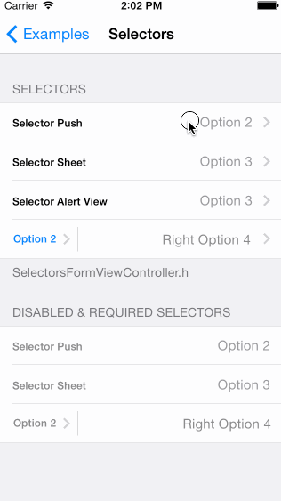
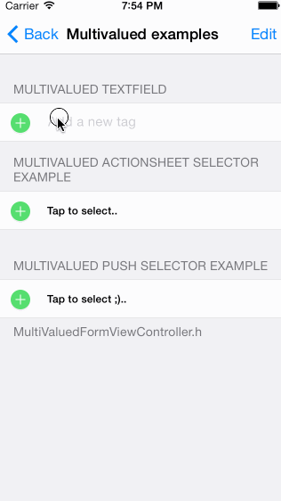
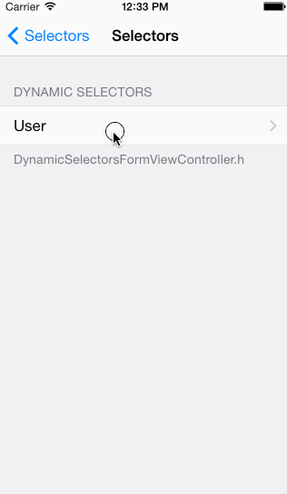
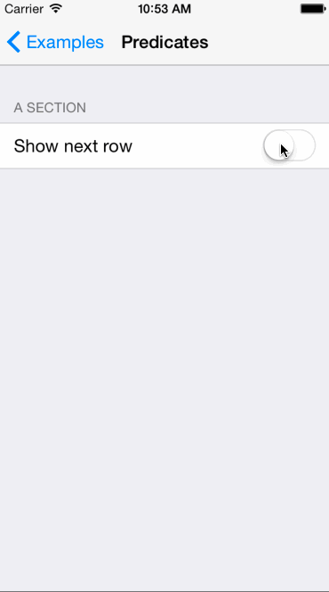
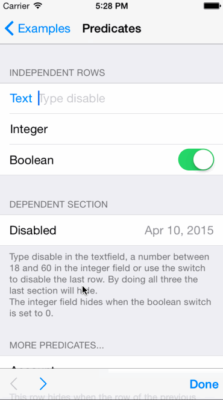

XLForm
---------------

By [XMARTLABS](http://xmartlabs.com).

[](https://travis-ci.org/xmartlabs/XLForm)
[](https://github.com/xmartlabs/XLForm/releases)

**If you are looking for Swift 2 native implementation we have recently created [Eureka], a complete re-design of XLForm in Swift 2.** *Do not panic, We will continue maintaining and improving XLForm, obj-c rocks!!*

Purpose
--------------

XLForm is the most flexible and powerful iOS library to create dynamic table-view forms. The goal of the library is to get the same power of hand-made forms but spending 1/10 of the time.

XLForm provides a very powerful DSL (Domain Specific Language) used to create a form. It keeps track of this specification on runtime, updating the UI on the fly.

#####Let's see the iOS Calendar Event Form created using XLForm


What XLForm does
----------------

 * Loads a form based on a declarative [*form definition*](#how-to-create-a-form "form definition").
 * Keeps track of definition changes on runtime to update the form interface accordingly. Further information on [*Dynamic Forms*](#dynamic-forms---how-to-change-the-form-dynamically-at-runtime "Dynamic Forms") section of this readme.
 * Supports multivalued sections allowing us to create, delete or reorder rows. For further details see [*Multivalued Sections*](#multivalued-sections-insert-delete-reorder-rows "Multivalued Sections") section bellow.
 * Supports [*custom rows definition*](#how-to-create-a-custom-row).
 * Supports custom selectors. For further details of how to define your own selectors check [*Custom selectors*](#custom-selectors---selector-row-with-a-custom-selector-view-controller "Custom Selectors") section out.
 * Provides several inline selectors such as date picker and picker inline selectors and brings a way to create custom inline selectors.
 * Form data validation based on form definition.
 * Ability to easily navigate among rows, fully customizable.
 * Ability to show inputAccessoryView if needed. By default a navigation input accessory view is shown.
 * Read only mode for a particular row or the entire form.
 * Rows can be hidden or shown depending on other rows values. This can be done declaratively using `NSPredicates`. (see [*Make a row or section invisible depending on other rows values*](#make-a-row-or-section-invisible-depending-on-other-rows-values "Using Predicates"))


## How to create a form

#### Create an instance of XLFormViewController

##### Swift

```swift
class CalendarEventFormViewController : XLFormViewController {

  required init(coder aDecoder: NSCoder) {
    super.init(coder: aDecoder)
    self.initializeForm()
  }


  override init(nibName nibNameOrNil: String?, bundle nibBundleOrNil: NSBundle?) {
    super.init(nibName: nibNameOrNil, bundle: nibBundleOrNil)
    self.initializeForm()
  }

  func initializeForm() {
    // Implementation details covered in the next section.
  }

}

```

##### Objective-C

```objc
#import "XLFormViewController.h"

@interface CalendarEventFormViewController: XLFormViewController

@end
```

```objc
@interface ExamplesFormViewController ()

@end

@implementation ExamplesFormViewController

- (instancetype)initWithNibName:(NSString *)nibNameOrNil bundle:(NSBundle *)nibBundleOrNil {
    self = [super initWithNibName:nibNameOrNil bundle:nibBundleOrNil];
    if (self){
        [self initializeForm];
    }
    return self;
}

- (id)initWithCoder:(NSCoder *)aDecoder {
    self = [super initWithCoder:aDecoder];
    if (self){
        [self initializeForm];
    }
    return self;
}

- (void)initializeForm {
  // Implementation details covered in the next section.
}

@end
```

##### Implementing the initializeForm method

To create a form we should declare it through a `XLFormDescriptor` instance and assign it to a `XLFormViewController` instance. As we said XLForm works based on a DSL that hides complex and boilerplate stuff without losing the power and flexibility of hand-made forms.

To define a form we use 3 classes:

 * `XLFormDescriptor`
 * `XLFormSectionDescriptor`
 * `XLFormRowDescriptor`

A form definition is a `XLFormDescriptor` instance that contains one or more sections (`XLFormSectionDescriptor` instances) and each section contains several rows (`XLFormRowDescriptor` instance). As you may have noticed the DSL structure is analog to the structure of a `UITableView` (Table -->> Sections -- >> Rows). The resulting table-view form's structure (sections and rows order) mirrors the definition's structure.

##### Let's see an example implementation of initializeForm to define the iOS Calendar Event Form

```objc
- (void)initializeForm {
  XLFormDescriptor * form;
  XLFormSectionDescriptor * section;
  XLFormRowDescriptor * row;

  form = [XLFormDescriptor formDescriptorWithTitle:@"Add Event"];

  // First section
  section = [XLFormSectionDescriptor formSection];
  [form addFormSection:section];

  // Title
  row = [XLFormRowDescriptor formRowDescriptorWithTag:@"title" rowType:XLFormRowDescriptorTypeText];
  [row.cellConfigAtConfigure setObject:@"Title" forKey:@"textField.placeholder"];
  [section addFormRow:row];

  // Location
  row = [XLFormRowDescriptor formRowDescriptorWithTag:@"location" rowType:XLFormRowDescriptorTypeText];
  [row.cellConfigAtConfigure setObject:@"Location" forKey:@"textField.placeholder"];
  [section addFormRow:row];

  // Second Section
  section = [XLFormSectionDescriptor formSection];
  [form addFormSection:section];

  // All-day
  row = [XLFormRowDescriptor formRowDescriptorWithTag:@"all-day" rowType:XLFormRowDescriptorTypeBooleanSwitch title:@"All-day"];
  [section addFormRow:row];

  // Starts
  row = [XLFormRowDescriptor formRowDescriptorWithTag:@"starts" rowType:XLFormRowDescriptorTypeDateTimeInline title:@"Starts"];
  row.value = [NSDate dateWithTimeIntervalSinceNow:60*60*24];
  [section addFormRow:row];
}
```

XLForm will load the table-view form from the previously explained definition. The most interesting part is that it will update the table-view form based on the form definition modifications.
That means that we are able to make changes on the table-view form adding or removing section definitions or row  definitions to the form definition on runtime and you will never need to care again about `NSIndexPath`, `UITableViewDelegate`, `UITableViewDataSource` or other complexities.

**To see more complex form definitions take a look at the example application in the Examples folder of this repository. You can also run the examples on your own device if you wish.** XLForm **has no** dependencies over other pods, anyway the examples  project makes use of some cocoapods to show advanced XLForm features.

## Using XLForm with Storyboards

* Perform the steps from **How to create a form**
* In Interface Builder (IB), drag-and-drop a **UIViewController** onto the Storyboard
* Associate your custom form class to the **UIViewController** using the **Identity Inspector**

How to run XLForm examples
---------------------------------

1. Clone the repository `git@github.com:xmartlabs/XLForm.git`. Optionally you can fork the repository and clone it from your own github account, this approach would be better in case you want to contribute.
2. Move to either the Objective-c or Swift [example folder](/Examples).
3. Install example project cocoapod dependencies. From inside Objective-c or Swift example folder run `pod install`.
4. Open XLForm or SwiftExample workspace using XCode and run the project. Enjoy!


Rows
---------------------
####Input Rows


Input rows allows the user to enter text values. Basically they use `UITextField` or `UITextView` controls. The main differences among the input row types is the `keyboardType`, `autocorrectionType` and `autocapitalizationType` configuration.

```objc
static NSString *const XLFormRowDescriptorTypeText = @"text";
```
Will be represented by a `UITextField` with `UITextAutocorrectionTypeDefault`, `UITextAutocapitalizationTypeSentences` and `UIKeyboardTypeDefault`.

```objc
static NSString *const XLFormRowDescriptorTypeName = @"name";
```
Will be represented by a `UITextField` with `UITextAutocorrectionTypeNo`, `UITextAutocapitalizationTypeWords` and `UIKeyboardTypeDefault`.

```objc
static NSString *const XLFormRowDescriptorTypeURL = @"url";
```
Will be represented by a `UITextField` with `UITextAutocorrectionTypeNo`, `UITextAutocapitalizationTypeNone` and `UIKeyboardTypeURL`.

```objc
static NSString *const XLFormRowDescriptorTypeEmail = @"email";
```
Will be represented by a `UITextField` with `UITextAutocorrectionTypeNo`, `UITextAutocapitalizationTypeNone` and `UIKeyboardTypeEmailAddress`.

```objc
static NSString *const XLFormRowDescriptorTypePassword = @"password";
```
Will be represented by a `UITextField` with `UITextAutocorrectionTypeNo`, `UITextAutocapitalizationTypeNone` and `UIKeyboardTypeASCIICapable`.
This row type also set the  `secureTextEntry` to `YES` in order to hide what the user types.

```objc
static NSString *const XLFormRowDescriptorTypeNumber = @"number";
```
Will be represented by a `UITextField` with `UITextAutocorrectionTypeNo`, `UITextAutocapitalizationTypeNone` and `UIKeyboardTypeNumbersAndPunctuation`.

```objc
static NSString *const XLFormRowDescriptorTypePhone = @"phone";
```
Will be represented by a `UITextField` with `UIKeyboardTypePhonePad`.

```objc
static NSString *const XLFormRowDescriptorTypeTwitter = @"twitter";
```
Will be represented by a `UITextField` with `UITextAutocorrectionTypeNo`, `UITextAutocapitalizationTypeNone` and `UIKeyboardTypeTwitter`.

```objc
static NSString *const XLFormRowDescriptorTypeAccount = @"account";
```
Will be represented by a `UITextField` with `UITextAutocorrectionTypeNo`, `UITextAutocapitalizationTypeNone` and `UIKeyboardTypeDefault`.

```objc
static NSString *const XLFormRowDescriptorTypeInteger = @"integer";
```
Will be represented by a `UITextField` with `UIKeyboardTypeNumberPad`.

```objc
static NSString *const XLFormRowDescriptorTypeDecimal = @"decimal";
```
Will be represented by a `UITextField` with `UIKeyboardTypeDecimalPad`.

```objc
static NSString *const XLFormRowDescriptorTypeTextView = @"textView";
```
Will be represented by a `UITextView` with `UITextAutocorrectionTypeDefault`, `UITextAutocapitalizationTypeSentences` and `UIKeyboardTypeDefault`.


####Selector Rows

Selector rows allow us to select a value or values from a list. XLForm supports 8 types of selectors out of the box:




```objc
static NSString *const XLFormRowDescriptorTypeSelectorPush = @"selectorPush";
```

```objc
static NSString *const XLFormRowDescriptorTypeSelectorActionSheet = @"selectorActionSheet";
```

```objc
static NSString *const XLFormRowDescriptorTypeSelectorAlertView = @"selectorAlertView";
```

```objc
static NSString *const XLFormRowDescriptorTypeSelectorLeftRight = @"selectorLeftRight";
```

```objc
static NSString *const XLFormRowDescriptorTypeSelectorPickerView = @"selectorPickerView";
```

```objc
static NSString *const XLFormRowDescriptorTypeSelectorPickerViewInline = @"selectorPickerViewInline";
```

```objc
static NSString *const XLFormRowDescriptorTypeSelectorSegmentedControl = @"selectorSegmentedControl";
```

```objc
static NSString *const XLFormRowDescriptorTypeMultipleSelector = @"multipleSelector";
```


Normally we will have a collection of object to select (these objects should have a string to display them and a value in order to serialize them), XLForm has to be able to display these objects.

XLForm follows the following rules to display an object:

1. If the value of the `XLFormRowDescriptor` object is nil, XLForm uses the `noValueDisplayText` row property as display text.
2. If the XLFormRowDescriptor instance has a `valueTransformer` property value. XLForm uses the `NSValueTransformer` to convert the selected object to a NSString.
3. If the object is a `NSString` or `NSNumber` it uses the object `description` property.
4. If the object conforms to protocol `XLFormOptionObject`, XLForm gets the display value from `formDisplayText` method.
5. Otherwise it return nil. That means you should conforms the protocol `:)`.


You may be interested in change the display text either by setting up `noValueDisplayText` or `valueTransformer` property or making the selector options objects to conform to `XLFormOptionObject` protocol.


This is the protocol declaration:

```objc
@protocol XLFormOptionObject <NSObject>

@required
-(NSString *)formDisplayText;
-(id)formValue;

@end
```


####Date & Time Rows

XLForms supports 3 types of dates: `Date`, `DateTime` , `Time` and `Countdown Timer` and it's able to present the `UIDatePicker` control in 2 different ways, inline and non-inline.


```objc
static NSString *const XLFormRowDescriptorTypeDateInline = @"dateInline";
```

```objc
static NSString *const XLFormRowDescriptorTypeDateTimeInline = @"datetimeInline";
```

```objc
static NSString *const XLFormRowDescriptorTypeTimeInline = @"timeInline";
```

```objc
static NSString *const XLFormRowDescriptorTypeCountDownTimerInline = @"countDownTimerInline";
```

```objc
static NSString *const XLFormRowDescriptorTypeDate = @"date";
```

```objc
static NSString *const XLFormRowDescriptorTypeDateTime = @"datetime";
```

```objc
static NSString *const XLFormRowDescriptorTypeTime = @"time";
```

```objc
static NSString *const XLFormRowDescriptorTypeCountDownTimer = @"countDownTimer";
```

Here is an example of how to define these row types:

**Objective C**
```objc
XLFormDescriptor * form;
XLFormSectionDescriptor * section;
XLFormRowDescriptor * row;

form = [XLFormDescriptor formDescriptorWithTitle:@"Dates"];

section = [XLFormSectionDescriptor formSectionWithTitle:@"Inline Dates"];
[form addFormSection:section];

// Date
row = [XLFormRowDescriptor formRowDescriptorWithTag:kDateInline rowType:XLFormRowDescriptorTypeDateInline title:@"Date"];
row.value = [NSDate new];
[section addFormRow:row];

// Time
row = [XLFormRowDescriptor formRowDescriptorWithTag:kTimeInline rowType:XLFormRowDescriptorTypeTimeInline title:@"Time"];
row.value = [NSDate new];
[section addFormRow:row];

// DateTime
row = [XLFormRowDescriptor formRowDescriptorWithTag:kDateTimeInline rowType:XLFormRowDescriptorTypeDateTimeInline title:@"Date Time"];
row.value = [NSDate new];
[section addFormRow:row];

// CountDownTimer
row = [XLFormRowDescriptor formRowDescriptorWithTag:kCountDownTimerInline rowType:XLFormRowDescriptorTypeCountDownTimerInline title:@"Countdown Timer"];
row.value = [NSDate new];
[section addFormRow:row];
```

**Swift**
```Swift

static let dateTime = "dateTime"
static let date = "date"
static let time = "time"

var form : XLFormDescriptor
var section : XLFormSectionDescriptor
var row : XLFormRowDescriptor

form = XLFormDescriptor(title: "Dates") as XLFormDescriptor

section = XLFormSectionDescriptor.formSectionWithTitle("Inline Dates") as XLFormSectionDescriptor
form.addFormSection(section)

// Date
row = XLFormRowDescriptor(tag: tag.date, rowType: XLFormRowDescriptorTypeDateInline, title:"Date")
row.value = NSDate()
section.addFormRow(row)

// Time
row = XLFormRowDescriptor(tag: tag.time, rowType: XLFormRowDescriptorTypeTimeInline, title: "Time")
row.value = NSDate()
section.addFormRow(row)

// DateTime
row = XLFormRowDescriptor(tag: tag.dateTime, rowType: XLFormRowDescriptorTypeDateTimeInline, title: "Date Time")
row.value = NSDate()
section.addFormRow(row)

self.form = form;

```
####Boolean Rows

XLForms supports 2 types of boolean controls:


```objc
static NSString *const XLFormRowDescriptorTypeBooleanCheck = @"booleanCheck";
```

```objc
static NSString *const XLFormRowDescriptorTypeBooleanSwitch = @"booleanSwitch";
```

We can also simulate other types of Boolean rows using any of the Selector Row Types introduced in the [Selector Rows section](#selector-rows).


####Other Rows

#####Stepper

XLForms supports counting using UIStepper control:


```objc
static NSString *const XLFormRowDescriptorTypeStepCounter = @"stepCounter";
```

You can set the stepper paramaters easily:

```objc
	row = [XLFormRowDescriptor formRowDescriptorWithTag:kStepCounter rowType:XLFormRowDescriptorTypeStepCounter title:@"Step counter"];
	row.value = @50;
	[row.cellConfigAtConfigure setObject:@YES forKey:@"stepControl.wraps"];
	[row.cellConfigAtConfigure setObject:@10 forKey:@"stepControl.stepValue"];
	[row.cellConfigAtConfigure setObject:@10 forKey:@"stepControl.minimumValue"];
	[row.cellConfigAtConfigure setObject:@100 forKey:@"stepControl.maximumValue"];
```

#####Slider

XLForms supports counting using UISlider control:


```objc
static NSString *const XLFormRowDescriptorTypeSlider = @"slider";
```

You can adjust the slider for your own interests very easily:

```objc
	row = [XLFormRowDescriptor formRowDescriptorWithTag:kSlider rowType:XLFormRowDescriptorTypeSlider title:@"Slider"];
	row.value = @(30);
	[row.cellConfigAtConfigure setObject:@(100) forKey:@"slider.maximumValue"];
	[row.cellConfigAtConfigure setObject:@(10) forKey:@"slider.minimumValue"];
	[row.cellConfigAtConfigure setObject:@(4) forKey:@"steps"];
```

Set `steps` to `@(0)` to disable the steps functionality.

#####Info

Sometimes our apps needs to show data that are not editable. XLForm provides us with `XLFormRowDescriptorTypeInfo` row type to display not editable info. An example of usage would be showing the app version in the settings part of an app.  

#####Button

Apart from data entry rows, not editable rows and selectors, XLForm has a button row `XLFormRowDescriptorTypeButton` that allows us to do any action when selected. It can be configured using a block (clousure), a selector, a segue identifier, segue class or specifing a view controller to be presented. ViewController specification could be done by setting up the view controller class, the view controller storyboard Id or a nib name. Nib name must match view controller class name.


Multivalued Sections (Insert, Delete, Reorder rows)
------------------------

Any `XLFormSectionDescriptor` object can be set up to support row insertion, deletion or reodering. It is possible to enable only one of these modes, a combination or all together.  
A multivalued section is just a section that support either of these modes.

The most interesting part of multivalued `XLFormSectionDescriptor` is that it supports all the types of rows that were shown on the [*Rows*](#rows "Rows") section as well as custom rows.




### How to set up a multivalued section

Creating a multivalued section is as simple as use one of the following convenience `XLFormSectionDescriptor` initializer:

```objc
+(id)formSectionWithTitle:(NSString *)title
		   sectionOptions:(XLFormSectionOptions)sectionOptions;
+(id)formSectionWithTitle:(NSString *)title
		   sectionOptions:(XLFormSectionOptions)sectionOptions
		sectionInsertMode:(XLFormSectionInsertMode)sectionInsertMode;
```

`sectionOptions` is a bitwise enum parameter that should be used to choose the multivalued section type/s (insert, delete, reorder). Available options are `XLFormSectionOptionCanInsert`, `XLFormSectionOptionCanDelete`, `XLFormSectionOptionCanReorder`. `XLFormSectionOptionNone` is the value used by default.

`sectionInsertMode` can be used to select how the insertion mode will look like. `XLform` has 2 different insertion modes out of the box: `XLFormSectionInsertModeLastRow` and `XLFormSectionInsertModeButton`. `XLFormSectionInsertModeLastRow` is the default value.


**Let's see how to create a multivalued section**

```objc
XLFormDescriptor * form;
XLFormSectionDescriptor * section;
XLFormRowDescriptor * row;

NSArray * nameList = @[@"family", @"male", @"female", @"client"];

form = [XLFormDescriptor formDescriptorWithTitle:@"Multivalued examples"];

// Enable Insertion, Deletion, Reordering
section = [XLFormSectionDescriptor formSectionWithTitle:@"MultiValued TextField"
										  sectionOptions:XLFormSectionOptionCanReorder | XLFormSectionOptionCanInsert | XLFormSectionOptionCanDelete];
section.multivaluedTag = @"textFieldRow";
[form addFormSection:section];

for (NSString * tag in nameList) {
	// add a row to the section, each row will represent a name of the name list array.
	row = [XLFormRowDescriptor formRowDescriptorWithTag:nil rowType:XLFormRowDescriptorTypeText title:nil];
	[[row cellConfig] setObject:@"Add a new tag" forKey:@"textField.placeholder"];
	row.value = [tag copy];
	[section addFormRow:row];
}
// add an empty row to the section.
row = [XLFormRowDescriptor formRowDescriptorWithTag:nil rowType:XLFormRowDescriptorTypeText title:nil];
[[row cellConfig] setObject:@"Add a new tag" forKey:@"textField.placeholder"];
[section addFormRow:row];
```


Form Values
------------------------

#### formValues

You can get all form values invoking `-(NSDictionary *)formValues;` either `XLFormViewController` instance or `XLFormDescriptor` instance.

The returned `NSDictionary` is created following this rules:

`XLForm` adds a value for each `XLFormRowDescriptor` that belongs to a `XLFormSectionDescriptor` doesn't have a `multivaluedTag` value set up. The dictionary key is the value of `XLFormRowDescriptor` `tag` property.

For each section that has a `multivaluedTag` value, XLForm adds a dictionary item with a  `NSArray` as a value, each value of the array is the value of each row contained in the section, and the key is the `multivaluedTag`.

For instance, if we have a section with the `multivaluedTag` property equal to `tags` and the following values on the contained rows: 'family', 'male', 'female', 'client', the generated value will be `tags: ['family', 'male', 'female', 'client']`


#### httpParameters

In same cases the form value we need may differ from the value of `XLFormRowDescriptor` instance. This is usually the case of selectors row and when we need to send the form values to some endpoint, the selected value could be a core data object or any other object. In this cases `XLForm` need to know how to get the value and the description of the selected object.

When using `-(NSDictionary *)httpParameters` method, XLForm follows the following rules to get `XLFormRowDescriptor` value:

1. If the object is a `NSString`, `NSNumber` or `NSDate`, the value is the object itself.
2. If the object conforms to protocol `XLFormOptionObject`, XLForm gets the value from `formValue` method.
3. Otherwise it return nil.

`multivaluedTag` works in the same way as in `formValues` method.


How to create a Custom Row
-------------------------------

To create a custom cell you need to create a UITableViewCell extending from `XLFormBaseCell`. `XLFormBaseCell` conforms to `XLFormDescriptorCell` protocol.

You may be interested in implement `XLFormDescriptorCell` methods to change the cell behaviour.

```objc
@protocol XLFormDescriptorCell <NSObject>

@required

@property (nonatomic, weak) XLFormRowDescriptor * rowDescriptor;

// initialise all objects such as Arrays, UIControls etc...
-(void)configure;
// update cell when it about to be presented
-(void)update;

@optional

// height of the cell
+(CGFloat)formDescriptorCellHeightForRowDescriptor:(XLFormRowDescriptor *)rowDescriptor;
// called to check if cell can became first responder
-(BOOL)formDescriptorCellCanBecomeFirstResponder;
// called to ask cell to assign first responder to relevant UIView.
-(BOOL)formDescriptorCellBecomeFirstResponder;
// called when cell is selected
-(void)formDescriptorCellDidSelectedWithFormController:(XLFormViewController *)controller;
// http parameter name used for network request
-(NSString *)formDescriptorHttpParameterName;

// is invoked when cell becomes firstResponder, could be used for change how the cell looks like when it's the forst responder.
-(void)highlight;
// is invoked when cell resign firstResponder
-(void)unhighlight;


@end
```


Once a custom cell has been created you need to let `XLForm` know about this cell by adding the row definition to `cellClassesForRowDescriptorTypes` dictionary.

```objc
[[XLFormViewController cellClassesForRowDescriptorTypes] setObject:[MYCustomCellClass class] forKey:kMyAppCustomCellType];
```

or, in case we have used nib file to define the `XLBaseDescriptorCell`:

```objc
[[XLFormViewController cellClassesForRowDescriptorTypes] setObject:@"nibNameWithoutNibExtension" forKey:kMyAppCustomCellType];
```

Doing that, XLForm will instantiate the proper cell class when kMyAppCustomCellType row type is used.


Custom Selectors - Selector Row with a custom selector view controller
--------------------------------------------

Almost always the basic selector which allows the user to select one or multiple items from a pushed view controller is enough for our needs, but sometimes we need more flexibility to bring a better user experience to the user or do something not supported by default.

Let's say your app user needs to select a map coordinate or it needs to select a value fetched from a server endpoint. How do we do that easily?


Define the previous selector row is as simple as ...

```objc
row = [XLFormRowDescriptor formRowDescriptorWithTag:kSelectorMap rowType:XLFormRowDescriptorTypeSelectorPush title:@"Coordinate"];
// set up the selector controller class
row.action.viewControllerClass = [MapViewController class];
// or
//row.action.viewControllerStoryboardId = @"MapViewControllerStoryboardId";
// or
//row.action.viewControllerNibName = @"MapViewControllerNibName";

// Set up a NSValueTransformer to convert CLLocation to NSString, it's used to show the select value description (text).  
row.valueTransformer = [CLLocationValueTrasformer class];
// Set up the default value
row.value = [[CLLocation alloc] initWithLatitude:-33 longitude:-56];
```


`action.viewControllerClass` controller class should conform to `XLFormRowDescriptorViewController` protocol.

In the example above, `MapViewController` conforms to `XLFormRowDescriptorViewController`.

```objc
@protocol XLFormRowDescriptorViewController <NSObject>

@required
@property (nonatomic) XLFormRowDescriptor * rowDescriptor;

@end
```

XLForm sets up `rowDescriptor` property using the `XLFormRowDescriptor` instance that belongs to the selector row.

The developer is responsible for update its views with the `rowDescriptor` value as well as set the selected value to `rowDescriptor` from within the custom selector view controller.

> Note: the properties `viewControllerClass`, `viewControllerNibName` or `viewControllerStoryboardId` are mutually exclusive and are used by `XLFormButtonCell` and `XLFormSelectorCell`. If you create a custom cell then you are responsible for using them. 


#### Another example





```objc
row = [XLFormRowDescriptor formRowDescriptorWithTag:kSelectorUser rowType:XLFormRowDescriptorTypeSelectorPush title:@"User"];
row.action.viewControllerClass = [UsersTableViewController class];
```

You can find the details of these examples within the example repository folder, [Examples/Objective-C/Examples/Selectors/CustomSelectors/](Examples/Objective-C/Examples/Selectors/CustomSelectors) and  [Examples/Objective-C/Examples/Selectors/DynamicSelector](Examples/Objective-C/Examples/Selectors/DynamicSelector).


Dynamic Forms - How to change the form dynamically at runtime
-------------------------------

Any change made on the `XLFormDescriptor` will be reflected on the `XLFormViewController` tableView. That means that when a section or a row is added or removed XLForm will animate the section or row accordingly.

We shouldn't have to deal with `NSIndexPaths` or add, remove `UITableViewCell` anymore. `NSIndexPath` of a specific `TableViewCell` changes along the time and this makes very hard to keep track of the `NSIndexPath` of each `UITableViewCell`.

Each XLForm `XLFormRowDescriptor` row has a `tag` property that is set up in its constructor. `XLFormDescriptor` has, among other helpers, an specific one to get a `XLFormRowDescriptor` from a `tag`.
It's much easier to manage `XLFormRowDescriptor`s using tags, the tag should be unique and it doesn't change on tableview additions modifications or deletions.

It's important to keep in mind that all the `UITableView` form modifications have to be made using the descriptors and not making modifications directly on the `UITableView`.

Usually you may want to change the form when some value change or some row or section is added or removed. For this you can set the `disabled` and `hidden` properties of the rows or sections. For more details see [*Make a row or section invisible depending on other rows values*](#make-a-row-or-section-invisible-depending-on-other-rows-values "Using Predicates").

In order to stay in sync with the form descriptor modifications your `XLFormViewController` subclass should override the `XLFormDescriptorDelegate` methods of 'XLFormViewController'.

> Note: It is important to always call the `[super ...]` method when overriding this delegate's methods.

```objc
@protocol XLFormDescriptorDelegate <NSObject>

@required

-(void)formSectionHasBeenRemoved:(XLFormSectionDescriptor *)formSection atIndex:(NSUInteger)index;
-(void)formSectionHasBeenAdded:(XLFormSectionDescriptor *)formSection atIndex:(NSUInteger)index;
-(void)formRowHasBeenAdded:(XLFormRowDescriptor *)formRow atIndexPath:(NSIndexPath *)indexPath;
-(void)formRowHasBeenRemoved:(XLFormRowDescriptor *)formRow atIndexPath:(NSIndexPath *)indexPath;
-(void)formRowDescriptorValueHasChanged:(XLFormRowDescriptor *)formRow oldValue:(id)oldValue newValue:(id)newValue;
-(void)formRowDescriptorPredicateHasChanged:(XLFormRowDescriptor *)formRow
                                   oldValue:(id)oldValue
                                   newValue:(id)newValue
                              predicateType:(XLPredicateType)predicateType;

@end
```

For instance if we want to show or hide a row depending on the value of another row:

```objc
-(void)formRowDescriptorValueHasChanged:(XLFormRowDescriptor *)rowDescriptor oldValue:(id)oldValue newValue:(id)newValue
{
	// super implmentation MUST be called
	[super formRowDescriptorValueHasChanged:rowDescriptor oldValue:oldValue newValue:newValue];
    if ([rowDescriptor.tag isEqualToString:@"alert"]){
        if ([[rowDescriptor.value valueData] isEqualToNumber:@(0)] == NO && [[oldValue valueData] isEqualToNumber:@(0)]){
            XLFormRowDescriptor * newRow = [rowDescriptor copy];
            [newRow setTag:@"secondAlert"];
            newRow.title = @"Second Alert";
            [self.form addFormRow:newRow afterRow:rowDescriptor];
        }
        else if ([[oldValue valueData] isEqualToNumber:@(0)] == NO && [[newValue valueData] isEqualToNumber:@(0)]){
            [self.form removeFormRowWithTag:@"secondAlert"];
        }
    }
```

Make a row or section invisible depending on other rows values
--------------------------------

###Summary

XLForm allows you to define dependencies between rows so that if the value of one row is changed, the behaviour of another one changes automatically. For example, you might have a form where you question the user if he/she has pets. If the answer is 'yes' you might want to ask how their names are.
So you can make a row invisible and visible again based on the values of other rows. The same happens with sections.
Take a look at the following example:



Of course, you could also do this manually by observing the value of some rows and deleting and adding rows accordingly, but that would be a lot of work which is already done.

###How it works

To make the appearance and disappearance of rows and sections automatic, there is a property in each descriptor:

```objc
@property id hidden;
```

This id object will normally be a NSPredicate or a NSNumber containing a BOOL. It can be set using  any of them or eventually a NSString from which a NSPredicate will be created. In order for this to work the string has to be syntactically correct.

For example, you could set the following string to a row (`second`) to make it disappear when a previous row (`first`) contains the value "hide".

```objc
second.hidden = [NSString stringWithFormat:@"$%@ contains[c] 'hide'", first];
```
This will insert the tag of the `first` after the '$', you can do that manually as well, of course. When the predicate is evaluated every tag variable gets substituted by the corresponding row descriptor.

When the argument is a NSString, a '.value' will be appended to every tag unless the tag is followed by '.isHidden' or '.isDisabled'. This means that a row (or section) might depend on the `value` or the `hidden` or `disabled` properties of another row. When the property is set with a NSPredicate directly, its formatString will not be altered (so you have to append a '.value' after each variable if you want to refer to its value). Setting a NSString is the simplest way but some complex predicates might not work so for those you should directly set a NSPredicate.

You can also set this properties with a bool object which means the value of the property will not change unless manually set.

To get the evaluated boolean value the `isHidden` method should be called. It will not re-evaluate the predicate each time it gets called but just when the value (or hidden/disabled status) of the rows it depends on changes. When this happens and the return value changes, it will automagically reflect that change on the form so that no other method must be called.

Here is another example, this time a bit more complex:




Disabling rows (set to read-only mode)
--------------------------------

Rows can be disabled so that the user can not change them. By default disabled rows have a gray text color. To disable a row the only thing that has to be done is setting its disabled property:

```objc
@property id disabled;
```
This property expects a NSNumber containing a BOOL, a NSString or a NSPredicate. A bool will statically disable (or enable the row). The other two work just like the hidden property explained in the section above. This means a row can be disabled and enabled depending on the values of other rows. When a NSString is set, a NSPredicate will be generated taking the string as format string so that it has to be consistent for that purpose.

A difference to the hidden property is that checking the disabled status of a row does not automatically reflect that value on the form. Tharefore, the XLFormViewController's updateFormRow method should be called.


Validations
------------------------------------

We can validate the form data using XLForm validation support.

Each `XLFormRowDescriptor` instance contains a list of validators. We can add validators, remove validators and validate a particular row using these methods:

```objc
-(void)addValidator:(id<XLFormValidatorProtocol>)validator;
-(void)removeValidator:(id<XLFormValidatorProtocol>)validator;
-(XLFormValidationStatus *)doValidation;
```

We can define our own custom validators just defining a object that conforms to `XLFormValidatorProtocol`.

```objc
@protocol XLFormValidatorProtocol <NSObject>

@required

-(XLFormValidationStatus *)isValid:(XLFormRowDescriptor *)row;

@end
```

[XLFormRegexValidator](XLForm/XL/Validation/XLFormRegexValidator.h) is an example of a validator we can create.


A very common validation is ensuring that a value is not empty or nil. XLFom exposes `required` XLFormRowDescriptor property to specify required rows.


To get all rows validation errors we can invoke the following `XLFormViewController` method:

```objc
-(NSArray *)formValidationErrors;
```


Additional configuration of Rows
--------------------------------

`XLFormRowDescriptor` allow us to configure generic aspects of a `UITableViewCell`, for example: the `rowType`, the `label`, the `value` (default value), if the cell is `required`, `hidden` or `disabled`, and so on.

You may want to set up another properties of the `UITableViewCell`. To set up another properties `XLForm` makes use of [Key-Value Coding](https://developer.apple.com/LIBRARY/IOS/documentation/Cocoa/Conceptual/KeyValueCoding/Articles/KeyValueCoding.html "Key-Value Coding") allowing the developer to set the cell properties by keyPath.

You just have to add the properties to `cellConfig` or `cellConfigAtConfigure` dictionary property of `XLFormRowDescriptor`.
The main difference between `cellConfig` and `cellConfigAtConfigure` is the time when the property is set up. `cellConfig` properties are set up each time a cell is about to be displayed. `cellConfigAtConfigure`, on the other hand, set up the property just after the init method of the cell is called and only one time.


For instance if you want to set up the placeholder you can do the following:

```objc
row = [XLFormRowDescriptor formRowDescriptorWithTag:@"title" rowType:XLFormRowDescriptorTypeText];
[row.cellConfigAtConfigure setObject:@"Title" forKey:@"textField.placeholder"];
[section addFormRow:row];
```

Let's see how to change the color of the cell label:

**Objective C**

```objc
row = [XLFormRowDescriptor formRowDescriptorWithTag:@"title" rowType:XLFormRowDescriptorTypeText];
[row.cellConfig setObject:[UIColor redColor] forKey:@"textLabel.textColor"];
[section addFormRow:row];
```

**Swift**
```Swift
row = XLFormRowDescriptor(tag: "title", rowType: XLFormRowDescriptorTypeText, title: "title")
row.cellConfig.setObject(UIColor.blackColor(), forKey: "backgroundColor")
row.cellConfig.setObject(UIColor.whiteColor(), forKey: "textLabel.textColor")
section.addFormRow(row)
```

FAQ
-------

#### How to assign the first responder on form appearance

Assign the first responder when the form is shown is as simple as setting the property `assignFirstResponderOnShow` to `YES`. By default the value of the property is `NO`.

```objc
@property (nonatomic) BOOL assignFirstResponderOnShow;
```

#### How to set a value to a row.

You should set the `value` property of `XLFormRowDescriptor` relevant instance.

```objc
@property (nonatomic) id value;
```

You may notice that the `value` property type is `id` and you are the responsable to set a value with the proper type. For instance, you should set a `NSString` value to a `XLFormRowDescriptor` instance of `XLFormRowDescriptorTypeText`.

You may have to update the cell to see the UI changes if the row is already presented.
`-(void)reloadFormRow:(XLFormRowDescriptor *)formRow` method is provided by `XLFormViewController` to do so.

#### How to set the default value to a row.

You should do the same as [*How to set a value to a row*](#how-to-set-a-value-to-a-row "How to set a value to a row").


#### How to set up the options to a selector row.

XLForm has several types of selectors rows. Almost all of them need to know which are the values to be selected. For a particular `XLFormRowDescriptor` instance you specify these values setting a `NSArray` instance to `selectorOptions` property.

```objc
@property NSArray * selectorOptions;
```

#### How to get form values

If you want to get the raw form values you should call `formValues` method of `XLFormDescriptor`. Doing that you will get a dictionary containing all the form values.
`tag` property value of each row is used as dictionary key. Only `XLFormROwDescriptor` values for non nil `tag` values are added to the dictionary.

You may be interested in the form values to use it as enpoint parameter. In this case `httpParameters` would be useful.

If you need something different, you can iterate over each row...

**Objective C**
```objc
 NSMutableDictionary * result = [NSMutableDictionary dictionary];
 for (XLFormSectionDescriptor * section in self.form.formSections) {
     if (!section.isMultivaluedSection){
         for (XLFormRowDescriptor * row in section.formRows) {
             if (row.tag && ![row.tag isEqualToString:@""]){
                 [result setObject:(row.value ?: [NSNull null]) forKey:row.tag];
             }
         }
     }
     else{
         NSMutableArray * multiValuedValuesArray = [NSMutableArray new];
         for (XLFormRowDescriptor * row in section.formRows) {
             if (row.value){
                 [multiValuedValuesArray addObject:row.value];
             }
         }
         [result setObject:multiValuedValuesArray forKey:section.multivaluedTag];
     }
 }
 return result;
```

**Swift**
```Swift
var results = [String:String]()
if let fullName = form.formRowWithTag(tag.fullName).value as? String {
    results[tag.fullName] = fullName
}
```

#### How to change UITextField length

You can change the length of a UITextField using the `cellConfigAtConfigure` dictionary property. This value refers to the percentage in relation to the table view cell.

**Objective C**
```objc
[row.cellConfigAtConfigure setObject:[NSNumber numberWithFloat:0.7] forKey:XLFormTextFieldLengthPercentage];
```
**Swift**
```Swift
row.cellConfigAtConfigure.setObject(0.7, forKey:XLFormTextFieldLengthPercentage)
```

**Note:**The same can be achieved for the UITextView when using `XLFormRowDescriptorTypeTextView`; just set your percentage for the key `XLFormTextViewLengthPercentage`.

#### How to change a UITableViewCell font

You can change the font or any other table view cell property using the `cellConfig` dictionary property. XLForm will set up `cellConfig` dictionary values when the table view cell is about to be displayed.

**Objective C**
```objc
[row.cellConfig setObject:[UIColor greenColor] forKey:@"textLabel.textColor"];
[row.cellConfig setObject:[UIFont fontWithName:FONT_LATO_REGULAR size:12.0] forKey:@"textLabel.font"];
[row.cellConfig setObject:[UIFont fontWithName:FONT_LATO_REGULAR size:12.0] forKey:@"detailTextLabel.font"];
```

**Swift**
```Swift
row.cellConfig.setObject(UIColor.whiteColor(), forKey: "self.tintColor")
row.cellConfig.setObject(UIFont(name: "AppleSDGothicNeo-Regular", size: 17)!, forKey: "textLabel.font")
row.cellConfig.setObject(UIColor.whiteColor(), forKey: "textField.textColor")
row.cellConfig.setObject(UIFont(name: "AppleSDGothicNeo-Regular", size: 17)!, forKey: "textField.font")
```

For further details, please take a look at [UICustomizationFormViewController.m](/Examples/Objective-C/Examples/UICustomization/UICustomizationFormViewController.m) example.

####How to set min/max for date cells?

Each XLFormDateCell has a `minimumDate` and a `maximumDate` property. To set a datetime row to be a value in the next three days you would do as follows:

**Objective C**
```objc
[row.cellConfigAtConfigure setObject:[NSDate new] forKey:@"minimumDate"];
[row.cellConfigAtConfigure setObject:[NSDate dateWithTimeIntervalSinceNow:(60*60*24*3)] forKey:@"maximumDate"];
```

**Swift**
```Swift
row.cellConfig.setObject(NSDate(), forKey: "maximumDate")
```

#### How to disable the entire form (read only mode).

`disable` XLFormDescriptor property can be used to disable the entire form. In order to make the displayed cell to take effect we should reload the visible cells ( [self.tableView reloadData] ).
Any other row added after form `disable` property is set to `YES` will reflect the disable mode automatically (no need to reload table view).

#### How to hide a row or section when another rows value changes.

To hide a row or section you should set its hidden property. The easiest way of doing this is by setting a NSString to it. Let's say you want a section to hide if a previous row, which is a boolean switch, is set to 1 (or YES). Then you would do something like this:
```objc
section.hidden = [NSString stringWithFormat:@"$%@ == 1", previousRow];
```
That is all!

#### What do I have to do to migrate from version 2.2.0 to 3.0.0?

The only thing that is not compatible with older versions is that the `disabled` property of the `XLFormRowDescriptor` is an `id` now. So you just have to add `@` before the values you set to it like this:
```objc
row.disabled = @YES; // before: row.disabled = YES;
```

#### How to change input accessory view (navigation view)

Overriding `inputAccessoryViewForRowDescriptor:` `XLFormViewController` method.
If you want to disable it completely you can return nil. But you can also customize its whole appearance here.

```obj-c
- (UIView *)inputAccessoryViewForRowDescriptor:(XLFormRowDescriptor *)rowDescriptor
{
      return nil; //will hide it completely
      // You can use the rowDescriptor parameter to hide/customize the accessory view for a particular rowDescriptor type.
}
```

#### How to set up a pushed view controller?

The view controller that will be pushed must conform to the `XLFormRowDescriptorViewController` protocol which consists of the following property:
```objc
@property (nonatomic) XLFormRowDescriptor * rowDescriptor;
```
This rowDescriptor refers to the selected row of the previous view controller and will be set before the transition to the new controller so that it will be accessible for example in its `viewDidLoad` method. That is where that view controller should be set up.

#### How to change the default appearance of a certain cell

The best way to do this is to extend the class of that cell and override its update and/or configure methods. To make this work you should also update the `cellClassesForRowDescriptorTypes` dictionary in your subclass of XLFormViewController by setting your custom class instead of the class of the cell you wanted to change.

#### How to change the returnKeyType of a cell

To change the returnKeyType of a cell you can set the `returnKeyType` and `nextReturnKeyType` properties. The former will be used if there is no navigation enabled or if there is no row after this row. In the other case the latter will be used.
If you create a custom cell and want to use these you should conform to the `XLFormReturnKeyProtocol` protocol.
This is how you can set them:
```
[row.cellConfigAtConfigure setObject:@(UIReturnKeyGo) forKey:@"nextReturnKeyType"];
```

#### How to change the height of one cell

If you want to change the height for all cells of one class you should subclass that cell and override the class method `formDescriptorCellHeightForRowDescriptor`. 
If you want to change the height of one individual cell then you can set that height to the `height` property of XLFormRowDescripto like this:
```
XLFormRowDescriptor* row = ... 
row.height = 55;
```

Installation
--------------------------

## CocoaPods

1. Add the following line in the project's Podfile file:
`pod 'XLForm', '~> 3.0'`.
2. Run the command `pod install` from the Podfile folder directory.

XLForm **has no** dependencies over other pods.

#### How to use master branch

Often master branch contains most recent features and latest fixes. On the other hand this features was not fully tested and changes on master may occur at any time. For the previous reasons I stongly recommend to fork the repository and manage the updates from master on your own making the proper pull on demand.


To use xmartlabs master branch.....

`pod 'XLForm', :git => 'https://github.com/xmartlabs/XLForm.git'`

You can replace the repository URL for your forked version url if you wish.

#### How to use XLForm in Swift files

If you have installed XLForm with cocoapods and have set `use_frameworks!` in your Podfile, you can add `import XLForm` to any Swift file.

If you are using cocoapods but have not set `use_frameworks!` in your Podfile, add `#import <XLForm/XLForm.h>` to your bridging header file.

For further details on how to create and configure the bridging header file visit [*Importing Objective-C into Swift*](https://developer.apple.com/library/ios/documentation/Swift/Conceptual/BuildingCocoaApps/MixandMatch.html "Importing Objective-C into Swift").


## Carthage

In your `Cartfile` add:

```
github "xmartlabs/XLForm" ~> 3.0
```

## Using git submodules

* Clone XLForm as a git [submodule](http://git-scm.com/docs/git-submodule) by running the following command from your project root git folder.

```bash
$ git submodule add https://github.com/xmartlabs/XLForm.git
```

* Open XLForm folder that was created by the previous git submodule command and drag the XLForm.xcodeproj into the Project Navigator of your application's Xcode project.

* Select the XLForm.xcodeproj in the Project Navigator and verify the deployment target matches with your application deployment target.

* Select your project in the Xcode Navigation and then select your application target from the sidebar. Next select the "General" tab and click on the + button under the "Embedded Binaries" section.

* Select `XLForm.framework` and we are done!

Requirements
-----------------------------

* ARC
* iOS 7.0 and above
* XCode 6.3+


Release Notes
--------------

Have a look at the [CHANGELOG](https://github.com/xmartlabs/XLForm/blob/master/CHANGELOG.md)

Author
-----------------

[Martin Barreto](https://www.github.com/mtnBarreto "Martin Barreto Github") ([@mtnBarreto](http://twitter.com/mtnBarreto "@mtnBarreto"))


Contact
----------------

Any suggestion or question? Please create a Github issue or reach us out.

[xmartlabs.com](http://xmartlabs.com) ([@xmartlabs](http://twitter.com/xmartlabs "@xmartlabs"))

[Eureka]: https://github.com/xmartlabs/Eureka
